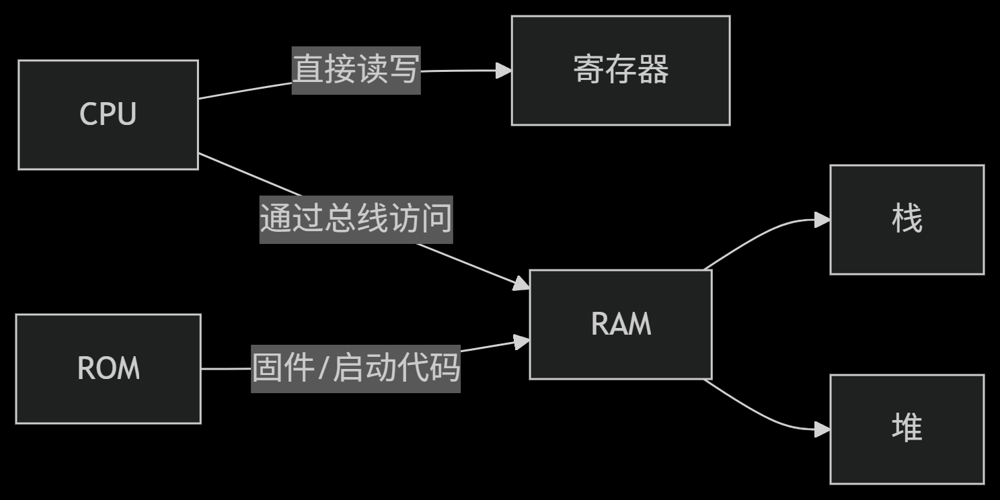
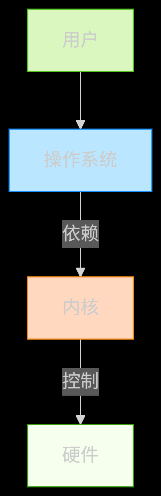
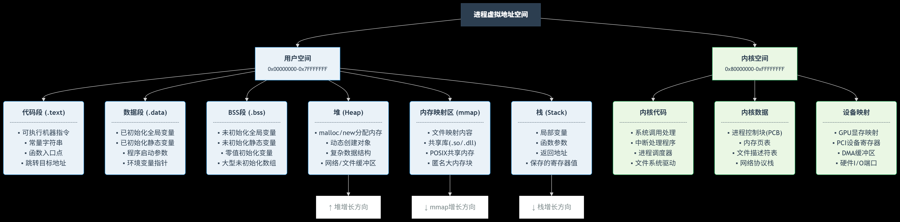
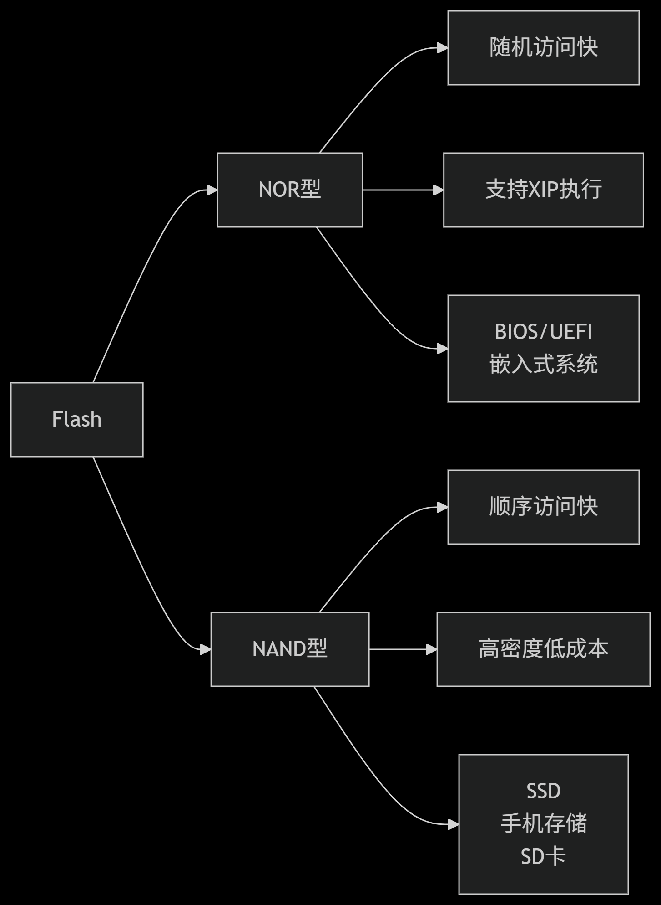
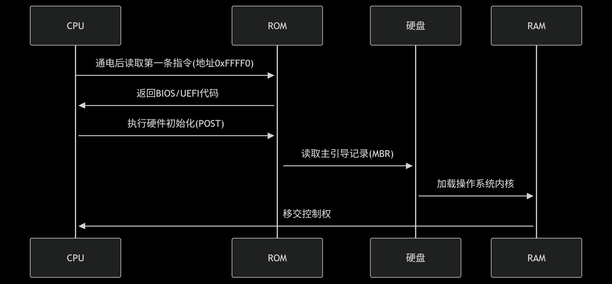
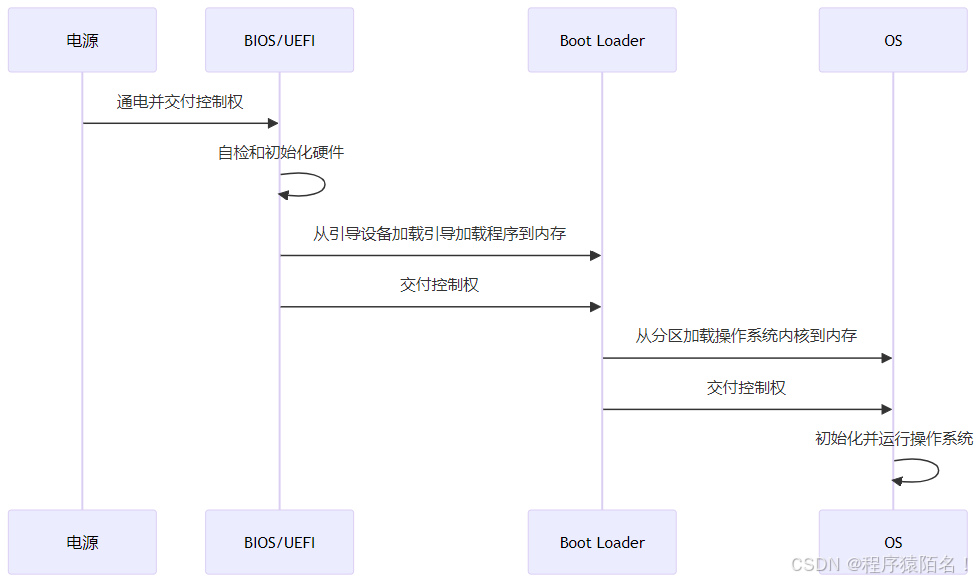
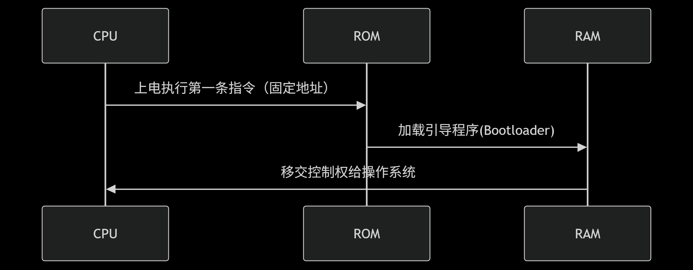
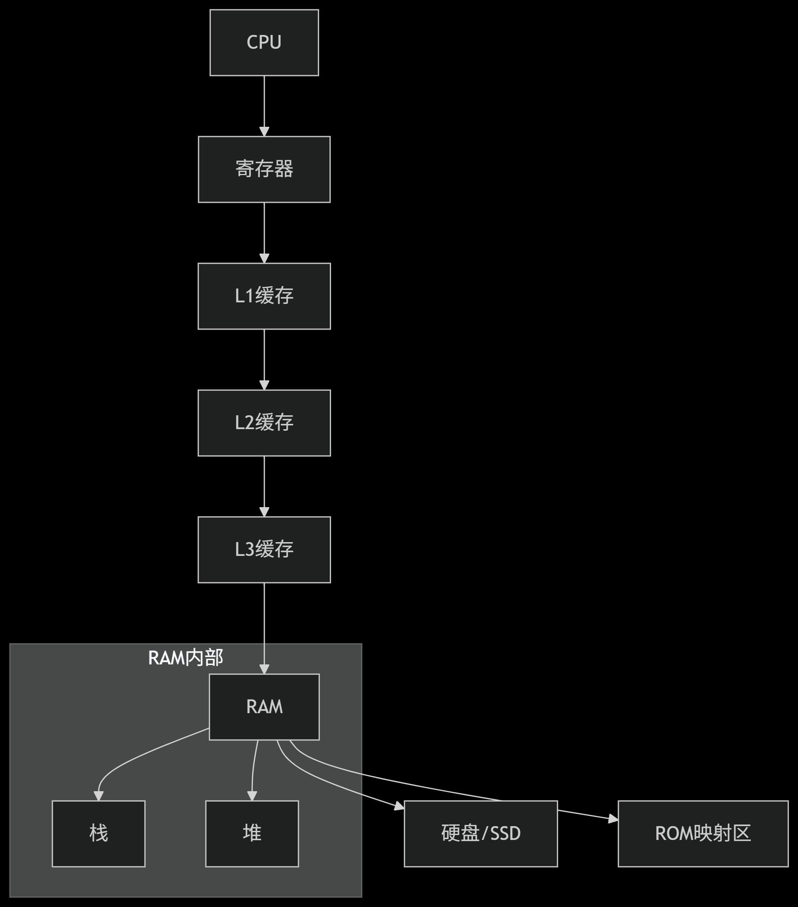
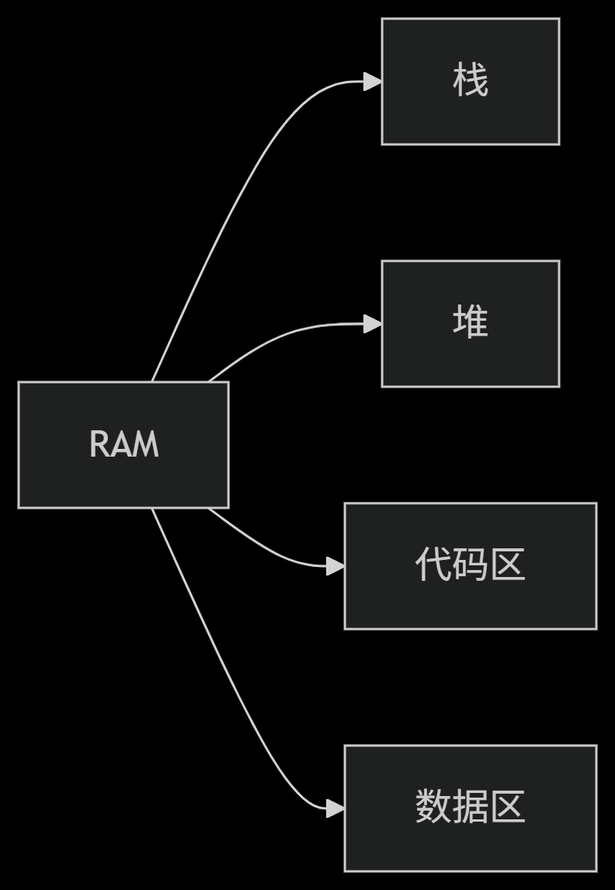

### register

```c
register
含义：建议编译器将变量存储在"CPU寄存器 中（非强制）。"

目的：提高访问速度（适用于频繁使用的变量）。

限制：

"不能取地址（如 &x），因为寄存器无内存地址。"

现代编译器自动优化寄存器分配，通常无需手动指定。

```

#### 衍生有关存储问题

```c
CPU <--(超高速访问)--> **寄存器** (位于CPU内部)
       |
       | (高速访问，通过总线)
       V
    " **缓存** (Cache, 通常分L1/L2/L3，位于CPU内部或紧邻CPU)
       |
       | (主存储器访问)
       V
     **RAM (随机存取存储器)** / **主内存 (Main Memory)** <- 通常指同一物理硬件
       |
       | 在RAM内部，操作系统划分出两个主要区域用于程序运行时：
       +-----------------------+
       |                       |
       V                       V
    **栈 (Stack)**          **堆 (Heap)**
       |                       |
       | (存储方法调用、局部变量)| (存储动态分配的对象)
       +-----------------------+


**硬盘/SSD (外部存储)** <--(慢速访问)--
```



##### cpu寄存器

```c
CPU 寄存器 (CPU Registers)
位置： 物理上嵌入在 CPU 芯片内部。是距离 CPU 核心计算单元最近的存储单元。
速度： 最快的存储类型。访问速度通常是纳秒级甚至亚纳秒级，与 CPU 时钟同步。
容量： 最小。数量非常有限（几十到几百个字节），每个寄存器有特定用途（如通用寄存器 AX/BX/CX/DX，指令指针 IP/EIP/RIP，栈指针 SP/ESP/RSP，基址指针 BP/EBP/RBP，状态/标志寄存器 FLAGS/EFLAGS/RFLAGS 等）。
功能：
"存储 CPU 当前正在处理的指令和数据。
存储指令指针（指向下一条要执行的指令地址）。
存储栈指针（指向当前栈顶地址）。
存储运算的中间结果和操作数。
存储处理器的状态信息 (如进位标志、零标志等)。
管理： 由 CPU 硬件直接管理和访问，对程序员（汇编/编译器）可见。
生命周期： 随指令执行而瞬间改变。
```

##### RAM**主内存** //BIOS

```c
RAM / 主内存 (Random Access Memory / Main Memory)
位置： 物理上是插在主板内存插槽上的内存条 (DIMM)。
速度： 远慢于 CPU 寄存器和缓存（相差几个数量级，访问时间在几十到上百纳秒级），但远快于硬盘/SSD。
容量： 远大于寄存器、缓存，远小于硬盘/SSD。现代计算机通常配备几 GB 到几百 GB 的 RAM。
功能：
	核心工作区： 存储当前正在运行的"操作系统内核"(1.进程管理，调度，创建销毁，上下文切换； 2.文件系统，磁盘空间管理，数据缓存，文件读写接口； 3.网络通信，TCP/IP，套接字接口，数据包路由； 4.设备驱动，硬件抽象层，中断处理，设备IO控制)、应用程序代码（从硬盘加载而来）、应用程序处理的数据。
	包含栈和堆： 栈和堆是操作系统在 RAM 中为每个进程/线程划分出来的逻辑区域。栈和堆是 RAM 的一部分！
	易失性： RAM 是 易失性存储器 (Volatile Memory)。断电后，存储在 RAM 中的所有数据（包括栈和堆的内容）都会丢失。
管理： 由操作系统的内存管理单元 (MMU - Memory Management Unit，通常是 CPU 的一部分) 进行管理。MMU 负责：
	虚拟地址到物理地址的转换。
	内存分配与回收（给进程/线程）。
	内存保护（防止进程访问非法内存区域）。
	分页/交换（当物理内存不足时，将不常用的页面换出到硬盘上的交换空间/pagefile/swap分区）。
    
    
    内核：
    操作系统内核是计算机系统的核心控制程序，
    它：
	 直接管理硬件资源（CPU/内存/设备）
	 为应用程序提供基础服务
	 在最高特权级运行（x86 Ring 0）
	 常驻内存永不停止
    
总结：内核的四大本质
	硬件抽象层
		将差异化的硬件统一为标准化接口
	资源管理者
		公平分配CPU/内存/IO资源
	系统服务提供者
		通过系统调用提供服务
	安全守护者
		隔离应用程序，防止相互破坏
    
    
    "BIOS（基本输入输出系统）和UEFI（统一可扩展固件接口）都是计算机启动时运行的固件，它们的主要功能是在操作系统启动之前初始化硬件组件。

"BIOS是最早使用的固件类型，它存储在计算机的ROM芯片中，负责在计算机启动时进行硬件检测（POST过程），加载引导加载程序，并将控制权交给操作系统。BIOS的设计相对简单，功能有限，且更新BIOS需要通过特定方式，有时还需要清除CMOS设置。

UEFI是BIOS的继任者，它提供了更强大的功能和更好的性能。UEFI使用的是32位或64位的操作环境，可以支持更大的存储设备，并且启动速度比传统的BIOS更快。UEFI还支持通过网络启动（网络唤醒）、安全启动（Secure Boot）等功能，提高了系统的安全性和可扩展性。此外，UEFI还提供了图形化的用户界面，使得用户在启动时可以更方便地进行设置调整。
```




###### 进程地址空间架构图 



```c
高地址 (0xFFFFFFFF)
+--------------------------------------+
| <b>内核空间</b>                       |
| - 系统调用处理程序                     |
| - 进程控制块(PCB)                     |
| - 设备映射(显存/寄存器)                |
+--------------------------------------+
|                                      |
| <b>栈 (Stack)</b>                    |
| - 局部变量                            | ← 栈指针(ESP)
| - 函数参数                            | ↓ 向下增长(向低地址拓展)
| - 返回地址                            |
|                                      |
+--------------------------------------+
|                                      |
| <b>内存映射区 (mmap)</b>              |
| - 文件映射内容                        | ↓ 向下增长(向低地址拓展)
| - 共享库(.so/.dll)                   |
| - 共享内存区域                        |
|                                      |
+--------------------------------------+
|                                      |
| <b>堆 (Heap)</b>                     |
| - malloc/new分配内存                  | ↑ 向上增长(向高地址拓展)
| - 动态创建对象                        |
| - 大型数据结构                        |
|                                      |
+--------------------------------------+
| <b>BSS段 (.bss)</b>                  |
| - 未初始化全局变量                  	|
| - 零值初始化变量                    	 |
| - 大型未初始化数组                 	|
+--------------------------------------+
| <b>数据段 (.data)</b>                 |
| - 已初始化全局变量                     |
| - 已初始化静态变量                     |
| - 程序启动参数                         |
+--------------------------------------+
| <b>只读数据段 (.rodata)</b>           |
| - 常量全局变量                        |
| - 格式化字符串                        |
| - 编译器跳转表                        |
+--------------------------------------+
| <b>代码段 (.text)</b>                 |
| - 可执行机器指令                       | ← 程序入口点
| - 函数入口点(_start)                   |
| - 常量字符串                           |
+--------------------------------------+
| <b>NULL区 (0x00000000)</b>            |
| - 空指针陷阱                           |
| - 禁止访问区域                         |
+--------------------------------------+
低地址 (0x00000000)
```

| **区域**     | **存储内容**      | **管理方式** | **增长方向** |
| ------------ | ----------------- | ------------ | ------------ |
| **.text**    | 可执行指令        | 只读         | 固定         |
| **.data**    | 初始化全局变量    | 编译时确定   | 固定         |
| **.bss**     | 未初始化全局变量  | 启动时清零   | 固定         |
| **Heap**     | 动态分配内存      | 手动/GC      | 向上         |
| **mmap**     | 文件/共享内存映射 | 按需加载     | 向下         |
| **Stack**    | 函数调用上下文    | 自动         | 向下         |
| **内核空间** | 操作系统核心组件  | 内核独占     | 固定         |

| **区域**   | **地址顺序** | **增长方向** | **大小特性**                               |
| ---------- | ------------ | ------------ | ------------------------------------------ |
| 内核空间   | 最高         | 固定         | 固定                                       |
| 栈区       | ↓            | 向下         | 固定(ulimit控制)(它的最大容量上限是固定的) |
| 内存映射区 | ↓            | 向下         | 动态                                       |
| 堆区       | ↑            | 向上         | 动态(仅受RAM限制)                          |
| BSS段      | -            | 固定         | 编译时确定                                 |
| 数据段     | -            | 固定         | 编译时确定                                 |
| 只读数据段 | -            | 固定         | 编译时确定                                 |
| 代码段     | -            | 固定         | 编译时确定                                 |
| NULL区     | 最低         | 固定         | 固定(约4KB)                                |

###### 进程地址空间和RAM的关系

```c
 1. 虚拟地址空间是每个进程看到的“内存视图”，由操作系统通过MMU（内存管理单元）和页表映射到物理内存（RAM）。
 2. RAM是实际的物理内存硬件，所有进程的数据最终都存储在RAM中（除非被换出到磁盘）。
 3. 进程地址空间中的不同区域（代码段、数据段、堆、栈、内存映射区）都映射到RAM的物理页帧上。
```


##### 寄存器和RAM的协做

```c
寄存器与RAM的协作
数据搬运工：CPU通过LOAD（RAM→寄存器）和STORE（寄存器→RAM）指令交换数据
    
LOAD 指令：用于从内存中读取数据并将其加载到寄存器中。这个过程也叫做内存读取，它使得处理器可以直接使用存储在内存中的数据进行计算。
STORE 指令：用于将寄存器中的数据存储到内存中。这个过程也叫做内存写入，它允许处理器将计算结果保存到内存里，以便之后使用或输出。
    
mov eax, [0x1000]  ; 将RAM地址0x1000的数据加载到eax寄存器
mov [0x2000], ebx  ; 将ebx寄存器值存入RAM地址0x2000
性能瓶颈：频繁RAM访问导致CPU等待（缓存缓解此问题）
```


##### ROM

```
Read-Only Memory，只读存储器
```

###### 1.1 **ROM的核心特性**


| **特性**     | **说明**                                          |
| ------------ | ------------------------------------------------- |
| **本质**     | 非易失性存储器（断电后数据不丢失）                |
| **主要用途** | 存储固件、引导程序、固定数据（如字库、常量表）    |
| **写入方式** | 需专用设备/协议擦写（普通用户"只读"）             |
| **访问速度** | 慢于RAM（NOR Flash：100-150ns，NAND Flash：25μs） |
| **寿命**     | 有限擦写次数（NOR：10万次，NAND：100万次）        |
| **成本**     | 低于RAM（单位容量成本约RAM的1/10）                |

###### 1.2**ROM技术演进与类型对比**

| **类型**                  | **写入原理**           | **特点**                     | **应用场景**           |
| ------------------------- | ---------------------- | ---------------------------- | ---------------------- |
| **掩膜ROM**               | 芯片制造时物理固化数据 | 不可修改、成本极低（量大时） | 游戏卡带、消费电子产品 |
| **PROM** (可编程ROM)      | 用户用烧录器熔断电路   | 一次性写入                   | 早期工业控制           |
| **EPROM** (可擦除PROM)    | 紫外线照射擦除         | 需拆下芯片擦写、窗口石英盖   | 80年代BIOS芯片         |
| **EEPROM** (电可擦除PROM) | 电压信号擦写           | 字节级擦写、速度慢           | 配置存储（主板设置）   |

###### 1.3 **现代Flash ROM（主流技术）**



###### 1.4**ROM在计算机系统中的核心作用**

启动引导流程



###### 1.5 ROM对比RAM

| **维度**     | **ROM**                  | **RAM**                |
| ------------ | ------------------------ | ---------------------- |
| **易失性**   | 非易失性（数据永久保存） | 易失性（断电数据丢失） |
| **写入速度** | 慢（NOR: 0.1-1MB/s）     | 极快（DDR5: 50GB/s）   |
| **读取速度** | 较慢（NOR: 100ns）       | 快（80ns）             |
| **改写能力** | 有限次数擦写             | 无限次改写             |
| **位错误率** | 较高（需ECC校验）        | 极低（<10^-18）        |
| **功耗**     | 待机功耗≈0               | 需持续刷新（1-5W/GB）  |
| **成本结构** | 芯片成本低，写入成本高   | 芯片成本高             |
| **物理结构** | 浮栅晶体管（存储电荷）   | 电容+晶体管（DRAM）    |

###### 1.6 ROM和bootloader

```c
bootloader作用：
1.硬件初始化：
	计算机刚通电时，CPU 处于一个非常原始的状态，大部分硬件（如内存控制器、时钟、基本输入输出设备如串口/屏幕、存储控制器等）都未初始化或处于未知状态。
	Bootloader 是开机后执行的第一段有效代码（在固件如 BIOS/UEFI 完成最基本的自检 POST 之后）。它负责执行最低级别的硬件初始化，使系统达到一个可以加载和运行更复杂程序（即操作系统内核）的稳定状态。
2.加载操作系统内核：
	这是 bootloader 最核心的任务。
	操作系统内核本身通常存储在外部的持久化存储设备（硬盘、SSD、Flash 等）上。CPU 不能直接访问这些设备上的文件。
Bootloader 知道如何与存储设备交互（通过其初始化好的控制器驱动），并知道从哪里（哪个设备、哪个分区、哪个文件路径）去读取操作系统的内核镜像文件（如 Linux 的 vmlinuz 或 bzImage， Windows 的 ntoskrnl.exe）以及相关的初始内存磁盘（如 initrd 或 initramfs）。
	Bootloader 将这些必要的文件从存储设备加载到系统内存（RAM） 中的指定位置
 3.设置启动参数：
	在将控制权交给操作系统内核之前，bootloader 需要为内核准备好它启动所需的环境和信息。
 4.移交控制权：
	当内核镜像被加载到内存中，并且启动环境设置妥当后，bootloader 执行一条特殊的跳转指令（jump），将 CPU 的执行权限完全移交给操作系统内核的入口点代码。
	从这一刻起，操作系统内核开始执行，接管计算机的所有资源和控制权，继续完成更高级别的初始化和启动用户空间的过程。
5.提供用户交互（可选但常见）：
	许多 bootloader（如 GRUB, U-Boot, rEFInd）提供一个简单的菜单界面或命令行界面。
允许用户：
	选择要启动的不同操作系统（多系统引导）。
	选择要启动的不同内核版本。
	在启动前修改内核启动参数（例如进入单用户模式、指定根文件系统、启用调试等）。
执行一些基本的诊断或修复命令。
6.支持安全启动（Secure Boot - 现代系统）：
	在 UEFI 系统中，bootloader 可以参与安全启动流程。固件（UEFI）会验证 bootloader 的数字签名，确保其来自可信来源且未被篡改。然后，bootloader 可能负责验证它要加载的操作系统内核的签名。这有助于防止恶意软件在启动早期阶段加载。
  固件（BIOS/UEFI）：是地面控制中心进行最基本的通电检查和发射台准备。

7.Bootloader：是火箭的第一级助推器和导航系统。
	它点燃引擎（初始化硬件）。
	它携带主载荷（操作系统内核）离开地面（从存储设备加载到内存）。
	它精确导航（设置启动参数）。
在达到一定高度和速度后，第一级分离（移交控制权）。
	操作系统内核：是火箭的第二级和核心舱，它接管后继续飞向轨道（完全启动系统并运行应用程序）。

```

```c
总结：

ROM： 是物理存储介质，提供非易失性存储。它是 Bootloader 第一阶段代码或基础固件（BIOS/UEFI/RBL）的“家”，确保了这些最底层代码的可靠性和安全性。

Bootloader： 是一段软件程序，负责启动的核心流程。它的起始部分必须存储在 ROM 中，因为 CPU 上电后只能从预设的 ROM 地址开始执行。后续阶段可能从 ROM 或其他存储（如 Flash, 硬盘）加载。

关系本质： ROM 为 Bootloader 的启动提供了必要的存储空间和执行的起点。Bootloader 是存储在 ROM 中并从中开始执行的核心启动逻辑。没有 ROM，Bootloader 无处安身；没有 Bootloader（或其前身固件），ROM 中的代码就无法引导系统启动。两者是启动链条中密不可分的环节。
```

###### 计算机启动流程



| **组件**         | **角色**                                                   | **协作关系**                                                 |
| ---------------- | ---------------------------------------------------------- | ------------------------------------------------------------ |
| **💾 ROM**        | **固化程序的物理载体** (如SPI Flash芯片)                   | 存储BIOS/UEFI固件代码 → CPU加电后从固定ROM地址读取第一条指令 |
| **⚡ CPU**        | **指令执行引擎**                                           | 复位后从ROM映射地址执行代码 → 运行BIOS/UEFI → 后续执行Bootloader和内核代码 |
| **🔌 BIOS/UEFI**  | **固件层** (存储在ROM中)                                   | 1️⃣ 硬件自检(POST) 2️⃣ 初始化基础硬件(内存/显卡) 3️⃣ 按引导顺序加载Bootloader到内存 4️⃣ 移交CPU控制权 |
| **🚀 Bootloader** | **引导加载程序** (存储在硬盘/SSD的引导分区)                | 1️⃣ 被BIOS/UEFI加载到内存 2️⃣ 提供启动菜单(多系统选择) 3️⃣ 加载OS内核及initramfs 4️⃣ 移交CPU控制权给内核 |
| **🖥️ OS内核**     | **操作系统核心** (如Linux的vmlinuz, Windows的ntoskrnl.exe) | 1️⃣ 接管CPU控制权 2️⃣ 初始化所有硬件设备 3️⃣ 挂载根文件系统 4️⃣ 启动init/systemd进程 |


##### **栈 (Stack)**

```c
位置： 位于 RAM (主内存) 中。是操作系统或运行时环境为每个线程分配的一块连续内存区域。
速度： 访问速度次于寄存器和缓存，但快于堆和外部存储。因为内存是连续的，且通过栈指针高效定位。
容量： 有限且通常较小。大小由操作系统或编译器预先设定（或可配置）。超出限制会导致著名的 StackOverflowError。
结构： LIFO (后进先出) 数据结构。像一个垂直堆叠的盘子，最后放上去的盘子（数据）最先被拿走。
功能：
	存储函数/方法调用的上下文：返回地址、参数、局部变量。
	存储线程的执行状态。
	在发生中断时保存 CPU 寄存器状态。
管理：
	自动管理。编译器在编译时就知道局部变量等的大小和生命周期。
通过两个专门的 CPU 寄存器高效管理：
	栈指针 (Stack Pointer - SP/ESP/RSP)： 始终指向栈的顶部（下一个可用位置或最后压入项的位置）。
	基址指针 (Base Pointer / Frame Pointer - BP/EBP/RBP)： 指向当前函数栈帧的基址，用于相对寻址访问参数和局部变量。
	函数调用时，数据压栈 (push)；函数返回时，数据弹栈 (pop)。
生命周期： 自动且短暂。变量的生命周期与其所在的作用域（通常是函数）严格绑定。函数结束，其栈帧即被回收。
分配/释放： 分配和释放操作（通过移动栈指针）极其快速（几乎就是修改一个寄存器值）
    
    "栈空间布局（自顶向下增长）
text
高地址 → 参数/返回地址 → 局部变量 → 栈指针(ESP)
```

##### **堆 (Heap)**

```c
位置： 位于 RAM (主内存) 中。是操作系统或运行时环境提供给应用程序使用的另一块内存区域，通常比栈大得多。
速度： 访问速度与栈同属于 RAM 级别（理论上），但通常略慢于栈。因为分配需要查找空闲块，且访问可能不连续（碎片化）。
容量： 大得多，且理论上只受物理 RAM 和操作系统限制。是动态内存分配的主要场所。
结构： 自由格式的内存池。分配的内存块在物理上不一定是连续的。
功能：
	存储动态分配的对象和数据结构（在 C/C++ 中用 malloc, calloc, new；在 Java/Python/Go 等语言中通过 new 关键字或对象构造隐式分配）。
存储生命周期不确定或需要跨函数存在的数据。
存储大块数据（如图片、文件缓冲区、大型集合）。

管理：
	手动或自动管理：
	手动管理 (如 C/C++)： 程序员显式调用 malloc/new 分配，调用 free/delete 释放。管理不当会导致内存泄漏或悬垂指针。
	自动管理 (垃圾回收 GC - 如 Java, C#, Go, Python, JavaScript)： 由语言的运行时环境（垃圾回收器）自动跟踪不再使用的对象并回收其内存。程序员无需（通常也无法）显式释放。
分配算法负责在堆中查找足够大的空闲内存块来满足请求（如首次适应、最佳适应等）。这比栈分配复杂得多。

生命周期： 不确定。从分配时刻开始，直到被程序员显式释放 (free/delete) 或被垃圾回收器回收。生命周期可以远远长于创建它的函数。
分配/释放： 相对较慢。分配涉及搜索空闲块、可能的分割与合并；释放涉及合并空闲块。在 GC 语言中，垃圾回收过程会引入显著的停顿（取决于 GC 算法）。
    
    "堆空间布局（自底向上增长）
text
低地址 → .data段 → .bss段 → 堆空间 → ... → 栈空间 → 内核空间
```

| 操作         | 栈的参与                   | 堆的参与                 | 寄存器中介          |
| ------------ | -------------------------- | ------------------------ | ------------------- |
| **函数调用** | 压入参数/返回地址/局部变量 | -                        | ESP存储栈顶地址     |
| **内存分配** | 分配指针变量(4/8字节)      | 分配实际数据块(动态大小) | EAX返回堆地址       |
| **数据处理** | 存储临时计算结果           | 存储大型对象/文件数据    | 数据通过寄存器中转  |
| **资源释放** | 函数返回时自动释放         | 需手动free()或GC回收     | ECX可能存储释放大小 |


##### 缓存

```c
缓存（Cache）是计算机存储体系中的核心优化机制，核心作用是弥合CPU与主内存（RAM）之间的巨大速度差，从而显著提升系统整体性能。
    作用：
    	CPU寄存器：访问速度 ≈ 0.3~1纳秒（与CPU时钟同步）。
		RAM（内存）：访问速度 ≈ 80~120纳秒（比寄存器慢约100倍）。
		结论：若CPU每次操作都直接读写RAM，会因等待数据而严重闲置，性能暴跌。
    
缓存的工作原理：局部性原理
	缓存的有效性基于两大关键特性：
	时间局部性（Temporal Locality）
		最近被访问的数据，很可能在短期内再次被访问（如循环变量）。
	空间局部性（Spatial Locality）
		访问某个地址时，其相邻地址的数据也可能被使用（如数组遍历）。
 	缓存策略：将CPU近期可能用到的数据块（Cache Line，通常64字节）从RAM复制到更靠近CPU的高速缓存中。
    
    缓存的层级结构
    	层级	位置	速度	容量	特性
        L1	每个CPU核心内部	最快（1ns）	极小（32-64KB）	分指令缓存(L1i)与数据缓存(L1d)
        L2	每个CPU核心独占	次快（3ns）	中等（256KB-1MB）	兼顾指令与数据
        L3	所有CPU核心共享	较慢（12ns）	较大（8-64MB）	降低多核访问内存的冲突
    
    数据访问路径：
    CPU → L1 → L2 → L3 → RAM → 硬盘（速度逐级降低，容量逐级增大）
    
缓存的关键运作机制
1."缓存命中（Cache Hit）
CPU请求的数据在缓存中找到 → 直接以接近寄存器速度返回数据（理想情况）。
高性能程序需尽量提高缓存命中率 (通常>90%)。
2.缓存未命中（Cache Miss）
数据不在缓存中 → 需从RAM加载数据到缓存（耗时增加百倍）。
    
    L1未命中 → 约10个时钟周期  
    L2未命中 → 约40个周期  
    L3未命中 → 约200个周期  
    访问RAM  → 约300个周期
    
3.缓存替换策略
当缓存满时，需淘汰旧数据（常用算法：LRU-最近最少使用）。
   
4.写策略
写直达（Write-Through）：同时更新缓存和RAM（简单但慢）。
写回（Write-Back）：只更新缓存，数据淘汰时才写回RAM（高效但复杂）
    
5.优化技巧
    数据布局优化
    "结构体对齐：减少跨缓存行访问（避免False Sharing）。
    "紧凑数据结构：如用uint8_t数组替代链表（提升空间局部性）。
    循环优化

    // 低效：跳跃访问（破坏空间局部性）
    for (int i = 0; i < N; i++) 
      sum += arr[i * stride];  

    // 高效：连续访问
    for (int i = 0; i < N; i++) 
      sum += arr[i];

    缓存分块（Cache Blocking）
    将大矩阵分解为小块处理，确保每块数据能完全载入缓存。

    预取（Prefetching）
    提前将数据加载到缓存（编译器或硬件自动完成，也可手动提示）。
```

##### 特性对比

| **特性**     | **CPU寄存器**      | **RAM**            | **ROM**            | **栈(Stack)**              | **堆(Heap)**            |
| ------------ | ------------------ | ------------------ | ------------------ | -------------------------- | ----------------------- |
| **物理位置** | CPU芯片内部        | 主板内存插槽       | 主板固件芯片       | RAM中的连续区域            | RAM中的动态区域         |
| **访问速度** | 0.3-1ns (最快)     | 80-120ns           | 100-500ns          | ≈RAM速度 (连续访问优化)    | ≈RAM速度 (分配有开销)   |
| **存储内容** | 当前指令/数据/地址 | 运行中的程序和数据 | 固件/BIOS/引导程序 | 函数参数/局部变量/返回地址 | 动态分配的对象/大数据块 |
| **管理方式** | CPU硬件直接管理    | 操作系统(MMU)      | 制造商预烧录       | 编译器自动管理             | 程序员手动或GC自动管理  |
| **生命周期** | 指令级 (纳秒级)    | 进程运行时         | 永久 (十年以上)    | 函数调用期间               | 分配后到释放前          |
| **分配效率** | 时钟周期级 (即时)  | 需OS介入           | 不可分配           | 极快 (移动指针)            | 较慢 (搜索空闲块)       |
| **容量范围** | 字节级 (数十个)    | GB级 (现代计算机)  | MB级               | MB级 (固定上限)            | GB级 (占剩余RAM)        |
| **增长方向** | -                  | -                  | -                  | 高地址→低地址              | 低地址→高地址           |
| **碎片问题** | 无                 | 存在               | 无                 | 无 (连续分配)              | 有 (需内存整理)         |
| **易失性**   | 断电丢失           | 断电丢失           | **断电保留**       | 断电丢失                   | 断电丢失                |
| **典型操作** | `mov eax, 5`       | 加载操作系统       | 执行BIOS代码       | `push`/`pop`               | `malloc()`/`free()`     |


##### 生命周期对比

| 组件    | 创建时机               | 销毁时机                   |
| ------- | ---------------------- | -------------------------- |
| 寄存器  | 指令需要时             | 寄存器被重写               |
| 栈数据  | 函数调用时             | 函数返回时                 |
| 堆数据  | `malloc()`/`new`调用时 | `free()`/垃圾回收/进程结束 |
| RAM数据 | 进程启动加载           | 进程退出或关机             |
| ROM数据 | 出厂烧录               | 物理擦除或芯片损坏         |

##### 核心交互关系

| **操作** | **寄存器作用**    | **RAM作用**  | **栈作用**        | **堆作用**   |
| -------- | ----------------- | ------------ | ----------------- | ------------ |
| 函数调用 | 存储返回地址(EIP) | 存储代码段   | 保存参数/局部变量 | -            |
| 内存分配 | 返回地址(EAX)     | 提供物理内存 | 存储指针变量      | 分配数据块   |
| 数据处理 | 算术运算单元      | 缓存数据块   | 存储中间结果      | 存储大型对象 |
| 系统启动 | 初始化关键状态    | 加载操作系统 | -                 | -            |
| 固件访问 | 端口地址操作      | 映射ROM区域  | -                 | -            |

##### 存储关系总结

| 组件       | 核心角色比喻             | 不可替代性                  |
| ---------- | ------------------------ | --------------------------- |
| **寄存器** | CPU的"工作台"            | 没有寄存器CPU无法执行指令   |
| **RAM**    | 程序运行的"操作车间"     | 所有运行中程序必须驻留RAM   |
| **ROM**    | 计算机的"基因库"         | 无ROM无法启动系统           |
| **栈**     | 函数调用的"自动化流水线" | 实现函数嵌套/局部变量管理   |
| **堆**     | 动态内存的"自由仓库"     | 灵活分配大块/长生命周期数据 |


```c
寄存器：CPU内部超高速工作区

RAM：程序运行的"主战场"（包含栈和堆）

ROM：永久存储固件

栈：RAM中管理函数调用的结构化区域

堆：RAM中动态分配内存的自由区域
```


##### ROM是如何启动系统的



```c
💡 ROM存储BIOS/UEFI，初始化硬件后将操作系统从硬盘加载到RAM
```




```
本质关系：
寄存器是CPU的手，RAM是工作台，栈/堆是台上的工具架，ROM是操作手册。CPU通过手册（ROM）启动系统，将原料（程序）放到工作台（RAM），用手（寄存器）操作工具（栈/堆）完成任务
```


##### 设计原则

```c
速度分层原则
寄存器 → 缓存 → RAM → ROM → 硬盘
高频数据靠近CPU，低频数据远离CPU

功能隔离原则

栈：自动管理的结构化内存 (函数上下文)

堆：手动管理的动态内存 (对象存储)

ROM：只读的持久化存储 (固件)

成本平衡原则

组件	成本/bit	速度	典型应用场景
寄存器	最高	最快	当前指令操作
SRAM	高	快	CPU缓存
DRAM	中	中等	主内存(RAM)
NAND	低	慢	ROM/SSD存储
```

##### **常见误区澄清**


###### 1.内存 ≠ RAM

- 广义内存：寄存器+缓存+RAM+ROM
- 狭义内存：通常特指RAM

###### 2.**栈堆都在RAM中**




###### 3.**ROM并非完全只读**

- 现代技术：EEPROM/Flash支持擦写
- 应用场景：BIOS更新、嵌入式系统编程

###### 4.**寄存器不是内存**

- 寄存器：CPU内部工作单元

- 内存：CPU外部存储单元

  

##### **总结：计算机存储体系核心逻辑**

**数据流向**：
`ROM → (启动) → RAM → (加载) → 栈/堆 ↔ (高频交互) ↔ 寄存器`

##### **设计哲学**：

**用0.1%的超高速存储(寄存器/缓存)加速99.9%的相对低速存储(RAM)**，通过局部性原理实现性能跃升。理解这些组件的定位与协作，是掌握计算机体系结构的基础。

### static

```c
static
用途：依据上下文分为两类：

局部静态变量（函数内部）：

生命周期：程序启动时创建，结束时销毁（与程序同生命周期）。

作用域：仍限于定义它的代码块。

初始化：只初始化一次（默认初始化为0）。

示例：

c
void counter() {
    static int count = 0; // 仅初始化一次
    count++;
    printf("%d\n", count);
}
// 调用 counter() 多次：输出 1, 2, 3...

全局静态变量/函数（文件内部）：

作用域：限制变量/函数仅在当前文件可见（避免命名冲突）。

示例：

c
// file1.c
static int hidden = 42; // 仅 file1.c 可访问
static void helper() {} // 仅 file1.c 可调用
```

### extern

```c
extern
含义：声明（但不定义）在其他文件中定义的全局变量或函数。

目的：实现跨文件共享全局数据。

生命周期：程序运行时存在。

作用域：全局（需配合定义使用）。

示例：

c
// file1.c
int globalVar = 100; // 实际定义

// file2.c
extern int globalVar; // 声明（使用 file1.c 中的定义）
void print() { printf("%d\n", globalVar); }
```

### 总结对比表

| 关键字         | 存储位置       | 生命周期     | 作用域           | 主要用途                     |
| -------------- | -------------- | ------------ | ---------------- | ---------------------------- |
| `auto`         | 栈             | 代码块内     | 局部             | 默认局部变量（C中显式少用）  |
| `register`     | 寄存器（建议） | 代码块内     | 局部             | 优化频繁访问的变量（已过时） |
| `static`       | 静态区         | 整个程序     | 局部或文件内部   | 持久化局部状态/文件内私有    |
| `extern`       | 全局区         | 整个程序     | 全局（跨文件）   | 共享全局变量/函数            |
| `thread_local` | 线程局部存储   | 线程生命周期 | 全局或静态作用域 | 线程私有数据                 |

