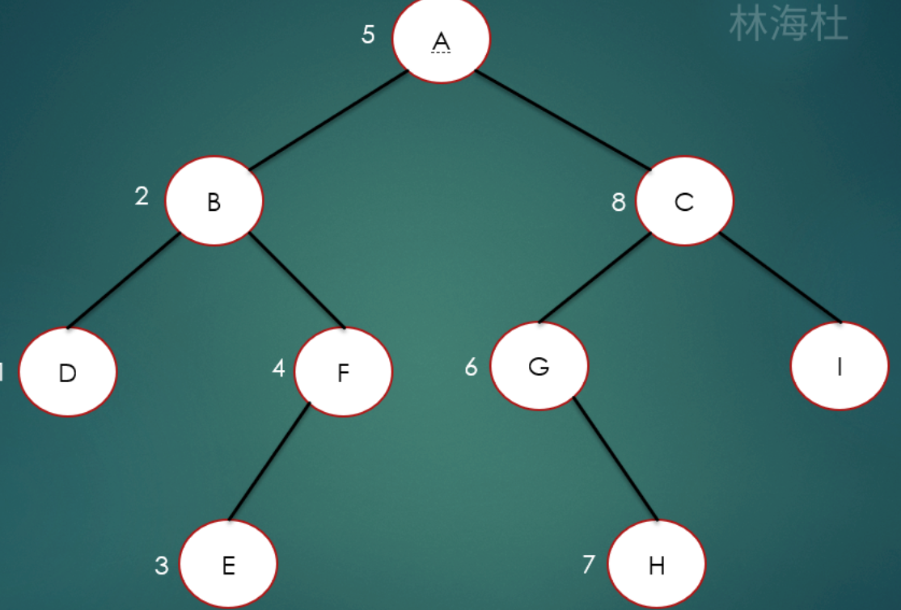
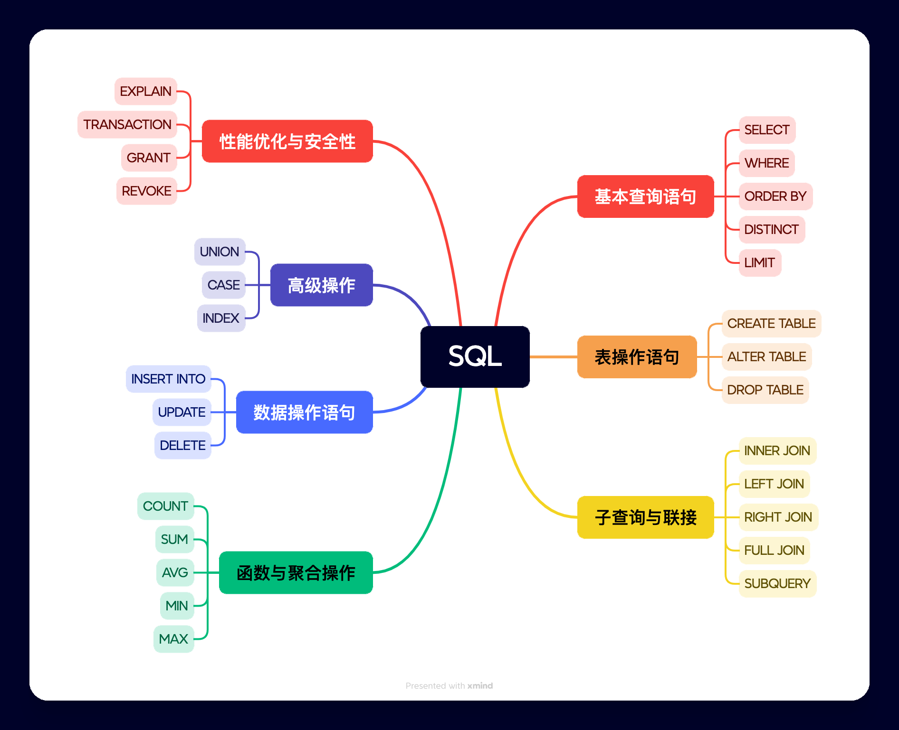

# 大纲

```c
安徽农商行计算机专员考试复习大纲
一、 考试科目概览（参考往年）
模块	主要内容	建议权重
公共基础知识	政治、法律、管理、人文、科技等	15%
职业能力测验（职测）	言语理解、逻辑推理、数量关系、资料分析	20%
专业综合知识	金融、经济、会计基础知识	10%
写作	材料作文、应用文写作	15%
计算机专业知识	核心部分，见详细分支	40%
注：每年题型分布可能微调，请以最新公告为准。

二、 分模块详细大纲
1. 公共基础知识
政治理论：马克思主义基本原理、中国特色社会主义理论体系、党和国家的方针政策、时事政治（近一年重大会议、文件）。

法律基础：宪法、民法、刑法、劳动法、银行法、合同法等常识。

管理与人文：管理学基本原理、公文写作常识、历史、地理、文化常识。

2. 职业能力测验（职测）
言语理解与表达：选词填空、片段阅读、语句排序。

判断推理：图形推理、定义判断、类比推理、逻辑判断。

数量关系：数字推理、数学运算（工程、行程、利润等问题）。

资料分析：文字材料、表格、图表的分析与计算。

3. 专业综合知识（金融经济会计）
金融学基础：货币与信用、金融机构体系、商业银行主要业务、货币政策、金融监管。

经济学基础：供求理论、市场结构、国民收入、通货膨胀、宏观经济政策。

会计学基础：会计要素与会计等式、借贷记账法、主要经济业务核算、财务报表。

4. 写作
公文写作：通知、报告、请示、函等常用公文的格式与要求。

议论文写作：给定材料，提炼观点，进行论述（类似申论大作文），关注经济金融、科技发展等热点话题。

5. 计算机专业知识（核心）  参考公考计算机考试选择题
计算机基础知识

计算机发展史、分类、特点

数制转换（二进制、八进制、十进制、十六进制）

数据表示（原码、反码、补码、ASCII码）

计算机硬件组成（CPU、存储器、输入/输出设备）

计算机软件分类（系统软件、应用软件）

操作系统

操作系统功能、分类

进程管理（进程状态、同步、死锁）

存储管理（分区、分页、分段、虚拟内存）

文件管理（文件结构、目录）

常用操作系统（Windows、Linux）基本操作与命令

办公自动化

Word：排版、表格、图文混排、邮件合并

Excel：公式与函数、数据排序/筛选/分类汇总、图表、数据透视表

PowerPoint：幻灯片制作、动画效果、母版使用

计算机网络

网络体系结构（OSI七层模型、TCP/IP四层模型）

网络协议（TCP、UDP、IP、HTTP、FTP、SMTP等）

IP地址与子网划分（IPv4、IPv6）

网络设备（路由器、交换机、防火墙）

局域网与广域网技术

网络故障排查常用命令（ping、ipconfig、netstat）

数据库技术

数据库系统基本概念（DB、DBMS、DBS）

数据模型（层次、网状、关系模型）

关系数据库（关系代数、关系完整性）

SQL语言（数据定义DDL、数据操纵DML、数据查询DQL、数据控制DCL）——重点练习

数据库设计（概念结构设计、逻辑结构设计、规范化）

常用数据库（MySQL、Oracle、SQL Server）基础

程序设计基础

程序设计语言分类（机器语言、汇编语言、高级语言）

数据结构基础（线性表、栈、队列、树、图）

算法基础（排序、查找）

常用编程语言（C、Java、Python）基本语法（根据自身掌握一门）

软件工程

软件生命周期、开发模型（瀑布、原型、敏捷）

需求分析、软件设计、测试方法（白盒、黑盒）

软件维护、项目管理

信息安全

网络安全威胁（病毒、木马、黑客攻击）

加密技术（对称加密、非对称加密）

防火墙、入侵检测系统

安全协议（SSL/TLS）

计算机等级保护、网络安全法常识

新技术与前沿热点

大数据、云计算、物联网、人工智能、区块链基础概念

金融科技（移动支付、互联网金融）
```

```

```

| 2026年政治理论核心考点预测 |                                                              |                                                              |
| -------------------------- | ------------------------------------------------------------ | ------------------------------------------------------------ |
| 考点模块                   | 核心关键词/新提法                                            | 可能的出题角度                                               |
| **年度总基调**             | **“十五五”开局、积极有为**                                   | 作为未来五年规划的开局之年，2026年的政策更多着眼于长期发展，强调宏观政策“更加积极有为”，注重存量与增量政策的“集成效应”。 |
| **经济目标**               | **GDP目标 4.5%~5.0%、物价合理回升**                          | 综合地方两会信息，全国GDP增速目标可能设定在更务实的4.5%~5.0%区间。货币政策的重要考量将包含推动物价“合理回升”。 |
| **宏观政策**               | **财政：更加积极、保持必要赤字** **货币：适度宽松、灵活高效** | **财政政策**：关注“保持必要的财政赤字、债务规模和支出总量”的提法，资金投向会更聚焦“两重”（国家重大战略和重大安全能力）和“两新”（新质生产力和新型消费）。 **货币政策**：从“适时”调整为“灵活高效”运用降准降息工具，强调与财政政策的协同配合。 |
| **头号任务**               | **内需主导、投资于物与人结合**                               | 扩大内需的地位从“扩内需”提升为“内需主导”。重点在于**“投资于物”（科技、基建）与“投资于人”（就业、增收、社保）的紧密结合**。预计会出台“城乡居民增收计划”。 |
| **民生热点**               | **常态化精准帮扶、银发经济、好房子**                         | **三农领域**：2026年中央一号文件提出“常态化精准帮扶”（过渡期后新提法）、“农业新质生产力”（首次写入无人机、机器人）、“粮食产量稳定在1.4万亿斤左右”。 **社会领域**：聚焦“一老一小”（3.2亿老年人口）、就业优先（稳岗扩容）、以及房地产领域的“好房子”建设和收购存量商品房用作保障房。 |
| **产业创新**               | **人工智能+、新质生产力、治理内卷**                          | **“人工智能+”行动**进入全面应用阶段，同时首提“完善人工智能治理”。 **新质生产力**强调因地制宜，防止同质化竞争，并明确提出要整治“内卷式”竞争。 |
| **三农工作**               | **常态化精准帮扶、农业新质生产力、第二轮土地承包延包**       | **关键词**：2026年是巩固拓展脱贫攻坚成果同乡村振兴有效衔接过渡期后的第一年，提出“**常态化精准帮扶**” 。 **新提法**：“**农业新质生产力**”（首次写入无人机、机器人） 。 **硬指标**：粮食产量稳定在“**1.4万亿斤左右**” |


## 一   公共基础知识


```c
二十四节气顺序为：
立春、雨水、惊蛰、春分、清明、谷雨、立夏、小满、芒种、夏至、小暑、大暑、立秋、处暑、白露、秋分、寒露、霜降、立冬、小雪、大雪、冬至、小寒、大寒。
```


## 二  职业能力测验（职测）


## 三  专业综合知识（金融经济会计）


## 四  写作


## 五  计算机专业知识（核心）

```c
1.微型计算机的三条总线通常指：地址总线、数据总线和控制总线。
    它们分别是连接CPU、内存和输入输出设备（I/O接口）进行信息传输的公共通信线路
    1.1 地址总线
    作用：用于传输由CPU发出的地址信息（即指明数据从内存或I/O端口中的哪个位置读出或写入）。
    特点：
        单向性：通常地址信息是由CPU向外发出的（在早期简单的系统中）。
        决定寻址能力：地址总线的宽度（位数）决定了CPU可以直接访问的存储空间大小。
        例如：如果地址总线有32根，则最大寻址空间为 2的32次方 = 4GB
    1.2 数据总线
    作用：用于在CPU、内存和输入输出设备之间传输实际的数据（指令码或数值）。
    特点：
        双向性：数据既可以从CPU传输到其他部件（写操作），也可以从其他部件传输到CPU（读操作）。
        决定传输效率：数据总线的宽度（位数）决定了CPU单次数据传输能传送多少bit的数据，通常与CPU的字长有关（如64位数据总线一次可传8字节）
    1.3 控制总线
        作用：用于传输控制信号和时序信号，以协调各部件的操作，并决定数据总线和地址总线的使用方向。
    包含的信号：
        读信号：通知内存或I/O设备准备被读取数据。
        写信号：通知内存或I/O设备准备接收数据。
        中断请求/响应：用于处理外部设备的紧急请求。
        时钟信号：用于同步各部件的操作节奏。
        特点：既有CPU发出的，也有其他部件发回给CPU的响应信号。

    '总结
        如果把计算机比作一家工厂：
        地址总线是地址标签（告诉货物去哪）；
        数据总线是传送带（货物本身）；
        控制总线是启动/停止按钮和指示灯（决定什么时候传，怎么传）。'
    
 
2.资源共享主要包括以下三类硬件共享,软件共享,数据共享
    2.1硬件共享
    硬件共享是指多个用户或多个计算任务共同使用同一台物理设备。其核心目的是提高硬件利用率，避免重复投资。
    计算资源共享（CPU/内存）
        内容：将高性能服务器或大型主机的处理器算力和内存空间分割给多个用户使用。
        例子：
        云计算：你在云平台上租用一台虚拟服务器（VPS），实际上你只是和他人共享了物理主机的一部分CPU和内存资源。
        超级计算机：科研人员提交计算任务，超级计算机将成千上万的CPU核心分配给不同任务同时使用。
    
    存储资源共享（磁盘空间）
        内容：将硬盘阵列的存储空间通过网络暴露给多台计算机使用。
        例子：
        NAS（网络附加存储）：家庭或公司里的NAS设备，手机、电脑、电视都可以直接播放存在里面的电影。
        SAN（存储区域网络）：大型数据中心使用的技术，让多台服务器共享一个高速磁盘阵列。

    外围设备共享（I/O设备）
        内容：让成本较高或不便每人配备的设备被多人共用。
        例子：
        网络打印机：办公室几十个人共用一台打印机。
        扫描仪/传真机：通过共享器连接到网络。
        绘图仪：设计部门多人共用一台大型绘图
    
    2.2软件共享
    软件共享是指用户无需在本地计算机上完整安装软件副本，或者多个程序可以共用同一套软件代码，通过网络或其他机制访问和使用软件功能。
        基于网络的软件共享（SaaS）
            内容：软件安装在服务商的服务器上，用户通过客户端（通常是浏览器）远程使用。
            例子：
            办公软件：Google Docs、腾讯文档、Office 365（在线版），多人可以同时在线编辑同一份文档。
            企业管理软件：公司使用的在线CRM（客户关系管理系统，如Salesforce）、在线ERP（企业资源计划系统），所有员工共享同一个软件平台。

        基于代码的软件共享（动态链接库）
            内容：在操作系统中，多个正在运行的程序可以共用内存中的同一份代码模块，以节省宝贵的内存空间。
            例子：
            DLL文件：Windows系统中的DLL（动态链接库）文件。假设你同时打开了三个需要特定绘图功能的软件，内存中只加载一份绘图DLL的代码，三个软件共享它。

        软件许可证共享
            内容：公司购买了一定数量的软件并发使用许可证，当用户启动软件时，从许可证服务器借用一份授权，用完归还。
            例子：设计公司购买了10个Adobe Creative Suite或AutoCAD的浮动许可证。公司有30个设计师，但同一时间最多只有10个人能打开软件，这10个人就在共享这10个许可证。
    
    2.3数据共享
    数据共享是指让不同用户、不同应用程序或不同设备能够访问和使用同一份数据（文件或数据库记录），确保信息的一致性和高效流通。
    
        文件共享
            内容：将存储在某台设备上的文件（文档、图片、视频）通过网络提供给其他设备访问。
            例子：
            共享文件夹：公司内部服务器设置一个共享盘（如：\server\共享文档），员工无需U盘传递，直接读取里面的文件。
            云盘同步：百度网盘、OneDrive，你把文件上传后，可以在手机、公司电脑、家里电脑上共享访问。
            P2P下载：BT下载就是一种典型的数据共享，你在下载的同时也在上传自己已有的部分给其他人。
    
        数据库共享
            内容：多个应用程序或用户同时对同一个数据库进行增删改查操作，数据库管理系统负责协调，保证数据不错乱。
            例子：
            铁路售票系统：全国的售票窗口和APP都共享同一个余票数据库。当你在手机上买了一张票，数据库中的余票数减1，售票窗口立刻就能看到更新。
            银行账户：ATM机、手机银行、柜台同时操作你的同一个账户，所有操作都是基于共享的核心账户数据库。

        通信信道共享
            内容：严格来说属于数据共享的底层基础，指多路信号共用同一根物理线路进行传输。
            例子：
            家庭宽带：一家人用Wi-Fi上网，所有人的数据包都通过同一条光纤进出，这是通过时分或频分技术共享信道。
            移动基站：在同一基站范围内的所有手机，共享该基站的无线频谱资源。
    
    '总结
    其实总线本身就是这三类资源共享的物理基础：
    它让CPU和内存共享了数据通道；
    它让多个I/O设备共享了对CPU的访问权；
    它使得程序指令和数据能够在各个部件之间共享传输路径。
    这三类共享的最终目标都是：降低成本、提高效率、方便协作。
    
    
 3.微型计算机中，CPU的组成分别是控制器和运算器
    3.1运算器
    别名：算术逻辑单元（ALU，Arithmetic Logic Unit）。
	作用：负责执行所有的算术运算和逻辑运算。
        算术运算：如加、减、乘、除等数学计算。
        逻辑运算：如与、或、非、比较、移位等判断操作。
        关键组成：它通常包含算术逻辑单元（ALU）和寄存器（用于暂存参与运算的数据和结果）。
    
    3.2控制器
    作用：负责指挥整个计算机系统协调工作。它是CPU的“指挥中心”或“神经中枢”。
    具体职能：
        取指令：从内存中取出指令。
        译码：分析指令需要执行什么操作。
        发控制信号：根据译码结果，向运算器、内存、输入输出设备发出控制信号，让它们执行相应的操作。
        控制程序流程：管理指令的执行顺序。
    
 '总结
    运算器负责执行（动手算）；
    控制器负责指挥（告诉别人怎么算）。
    补充说明：在现代CPU中，为了提升性能，通常还包含寄存器阵列（快速存储临时数据）和高速缓存（Cache），但从经典的结构划分来看，最核心的两部分依然是运算器和控制器。'
    
    
 4.在微机中，常用的软盘存储器，按其记录密度的大小，可分为低密度和高密度指的就是720KB（DD）和1.44MB（HD）的区别。
    
 5.按病毒设计者的意图和破坏性大小，可将计算机病毒分为良性病毒和恶性病毒
    良性病毒：这是一种恶作剧性质的病毒。设计者的目的不是为了对计算机系统造成严重破坏，而主要是为了表现自己或开个玩笑。它们通常		不会破坏系统数据，但可能会占用系统资源（如CPU时间、内存），导致运行速度变慢或干扰用户的正常工作
    恶性病毒：这类病毒具有明确的破坏意图。设计者的目的是破坏计算机系统中的数据或文件。其破坏性和危害性很大，可能会删除文件、对		硬盘进行格式化，或者造成系统崩溃。即使病毒被清除，其造成的破坏（如数据丢失）也往往难以恢复
    
    计算机病毒是人为编写的恶意程序代码，它最核心的本领就是能自我复制并感染其他程序，就像生物病毒入侵细胞一样，最终影响计算机的正常运行

'计算机病毒的“性格特征”
	就像一个完整的生物病毒有自己的习性，计算机病毒也具备以下几个鲜明的特征：
    传染性：这是病毒最根本的特征。它会像瘟疫一样，通过各种渠道（如文件、网络）从一个程序传到另一个程序，从一台电脑传到另一台电脑。
    潜伏性：很多病毒不是一感染就发作。它们会狡猾地隐藏在系统中，平时毫无症状，等到某个特定条件满足时才突然爆发。
    隐蔽性：为了不被发现，病毒通常很小，并会巧妙地附着在正常程序或文件中，很难被察觉。
    破坏性：无论是否有意，病毒都会对系统造成影响。轻则占用资源导致电脑变慢，重则删除文件、格式化硬盘，甚至破坏硬件，造成无法挽回的损失。
    可触发性：病毒的发作通常有“开关”。这个开关可能是某个日期、时间，或是特定的文件类型和操作
    
 6.在内存储器中，只能读出不能写入的存储器叫做只读存储器(ROM) 
        比较维度	RAM (随机存取存储器)	                          ROM (只读存储器)
        中文全称	随机存取存储器			                         只读存储器
        数据保持性	易失性 (断电数据丢失)                            非易失性 (断电数据保留)
        读写特性	可读可写 (速度快)	                              通常只读，写入较慢或需要特殊条件
        主要用途	操作系统运行空间、应用程序暂存、正在处理的数据	     存储固件 (BIOS/UEFI)、嵌入式设备程序
        容量大小	通常较大 (GB级别)	                               通常较小 (MB级别)
        速度	      非常快	                                        相对较慢
    
 7.在计算机内部，一切信息的存放、处理和传递均采用二进制的形式
   
 8.计算机的存储单元中存储的内容是指令和数据
    
 9.在多层目录中允许存在多个同名文件，只要分布在不同目录即可
    
 10. 在Windows中，欲将整幅屏幕内容复制到剪贴板上，应使用PrintSCreen键。
    
 11.位是物理最小单位，字节是存储最小单位，字是CPU处理的最小单位，双字是两个字打包处理
    字
    英文：Word
    定义：字是计算机设计时定义的一个自然数据单位，它等于 CPU 内部进行数据处理时一次能并行处理的二进制位数（即 CPU 的字长）。
    关键点：字的大小不是固定的，取决于CPU的架构。
    对于 16 位处理器（如 80286），1 字 = 16 位 = 2 字节。
    对于 32 位处理器（如 80386 及后来的奔腾），1 字 = 32 位 = 4 字节。
    对于 64 位处理器，1 字 = 64 位 = 8 字节。
    通俗理解：字的长度决定了计算机的"吞吐量"。字长越长，电脑一次能算的东西就越多，性能通常越强。

    双字
    英文：Double Word
    定义：双字是字的倍数，即 两个字 的长度。
    在 16 位系统中，1 双字 = 32 位 = 4 字节。
    在 32 位系统中，1 双字 = 64 位 = 8 字节。
    在 64 位系统中，1 双字 = 128 位 = 16 字节。
    用途：在编程和指令集中，为了处理更大的数据，经常会用到双字类型（例如在 Windows API 编程中，DWORD 类型通常就是 32 位，即 4 字节）。
    
12.计算机能够直接识别和处理的语言是机器语言
    
语言类型	特点	                                                      是否需要翻译	                示例
机器语言	纯二进制代码（如 10110000 01100001），能被硬件直接执行	 不需要	                         直接控制CPU
汇编语言	用助记符（如 MOV AL, 61h）代替二进制，方便人记忆和编写	   需要（通过汇编器翻译成机器语言）	    低级编程
高级语言	类似人类语言（如 a = 97），易于理解和编写	              需要（通过编译器或解释器翻译成机器语言）C、Java、Python
    
13.微型计算机的运算器、控制器及内存储器的总称是主机。
    运算器 和 控制器 通常合称为中央处理器（CPU）。
    中央处理器 再加上内存储器，就构成了主机。
    需要注意的是，这里的主机通常指安装在主机箱内的核心部件总和。在更广泛的日常用语中，有时人们会把主机箱及其内部所有硬件（包括硬盘、电源等）统称为主机，但在计算机原理的严格定义中，主机 = CPU + 内存。
    
14.  CAD 是计算机的主要应用领域之一，它的含义是 计算机辅助设计。
    核心概念
它指的是利用计算机及其图形设备帮助设计师进行设计工作的过程或软件系统。

辅助，而非自动：CAD 的核心在于“辅助”。它并不是说把设计交给计算机，计算机就能自动完成；而是设计师借助计算机强大的计算能力和图形处理能力，来更高效、更精确地完成绘图、计算和分析等任务。

主要功能：

几何建模：创建产品的二维工程图或三维立体模型。

工程分析：对设计进行强度、应力、运动学等模拟分析。

生成图纸：自动生成符合标准的尺寸标注、材料清单等。

    常见的应用领域
    CAD 技术广泛应用于需要精确设计和绘图的行业：
    机械制造：设计零件、装配体、模具。
    建筑工程：绘制建筑平面图、立面图、结构施工图。
    电子电路：设计集成电路版图、印刷电路板。
    服装设计：进行服装打版、放码。
    影视动画：进行三维建模（常与计算机图形学结合
 
15.电子计算机的最早应用领域是军事领域，具体来说，是数值计算（或称为科学计算）
    当初，世界上第一台电子数字计算机ENIAC的研制目的是为了进行火炮的弹道计算，可见，电子计算机的最初应用主要是科学计算，由于计算机的通用性，它对科学技术的发展影响非常深远
    
16.关闭一个活动应用程序窗口，可按快捷键Alt＋F4
    另一个相关的快捷键是 Ctrl + W，但它通常用于关闭浏览器的当前标签页或某些程序的文档选项卡，而不是整个应用程序。
    
17.现代计算机中采用二进制数制是因为二进制数的优点
    二进制电路简单、运算规则少、逻辑性强、可靠性高，使得它成为了现代计算机设计的基础。
 
18.在衡量计算机的主要性能指标中，字长是指 CPU（中央处理器）一次能够并行处理（或运算）的二进制位数。
    字长的详细说明：
	18.1. 核心含义
        并行处理能力：如果CPU的字长是32位，意味着它在一个时钟周期内最多能处理32位（即4个字节）的数据。如果是64位，则能处理64位（8个字节）的数据。
        如同车道：可以把字长比作公路上的车道数量。字长越长，车道越宽，同一时间能通过的数据流就越大，数据处理能力也就越强。
	18.2. 字长的影响	
        计算精度：字长越长，能表示的数值范围就越大，精度也越高。
        处理速度：在处理大数据时，字长长的CPU需要的运算次数更少，速度更快（例如，64位CPU处理一个64位整数比32位CPU快得多）。
        寻址能力：字长通常也决定了CPU的寻址空间。例如，32位CPU最大只能支持约4GB（2的32次方字节）的内存寻址，而64位CPU则可以支持远超4GB的海量内存。
    总结：
		字长是计算机处理能力的标尺，它直接反映了CPU的内部结构规格。在其他指标（如主频）相同时，字长越长，计算机的性能通常越强。
    
19.死锁
    在计算机系统中，死锁就是类似的情况。它是指两个或多个进程在执行过程中，因争夺资源而造成的一种互相等待的现象，如果没有外力作用，它们都将无法继续推进。
    19.1死锁产生的原因
    死锁的产生主要有两个根源：
    系统资源不足：系统中存在多个进程需要同时独占某些资源（如打印机、扫描仪、数据缓冲区等），而资源的数量不足以满足所有进程的需求。
    进程推进顺序不当：进程在请求和释放资源的顺序上出现了交叉，导致了循环等待。
   
    19.2产生死锁的四大必要条件
	这四个条件必须同时满足，死锁才会发生。这就像四个机关必须全部打开，陷阱才会触发。
    a.互斥条件	          资源被某个进程独占，其他进程不能同时使用。
    b.请求与保持条件	    进程已经占用了至少一个资源，同时又提出了新的资源请求，并且不释放自己已占有的资源。
    c.不剥夺条件	          进程获得的资源，在未使用完之前，不能被系统强行剥夺，只能由进程自己主动释放
    d. 循环等待条件	     存在一组进程 {P1, P2, ..., Pn}，P1在等待P2占有的资源，P2在等待P3占有的资源，……，Pn在等待P1占有的资源，形成了一个等待环。
     
    总结：死锁的本质是“互相谦让”的反面——互相等待。在多线程编程中，为了避免死锁，开发者通常会遵循一些原则，例如：尽量不在持有锁的情况下再去请求别的锁，或者使用超时机制（如果一段时间内拿不到锁，就释放已持有的锁并重试）。
    
    
20.Excel 中，常用函数
   COUNT 函数用于计算包含数字的单元格个数以及数字列表中的数字个数。
   SUM	求和，计算指定单元格区域中所有数值的和。	=SUM(A1:A10) 计算 A1 到 A10 的总和。
   AVERAGE	求平均值，返回参数的算术平均值。	=AVERAGE(B1:B10) 计算 B1 到 B10 的平均值。
   MAX / MIN	返回一组数值中的最大值 / 最小值。	=MAX(C1:C100) 找出 C 列的最高分。
   COUNTIF	条件计数，统计满足某个条件的单元格个数。	=COUNTIF(D1:D50,">60") 统计 D 列大于 60 的数量。
   SUMIF	条件求和，对满足条件的单元格求和。	=SUMIF(E1:E10,"销售部",F1:F10) 统计销售部的业绩总和。
    
    
21.在资源管理器的文件栏中，文件夹是按照树形结构（或称层次结构）关系来组织的

22.数据库是统一管理的相关数据的集合，它具有数据结构化，数据的共享性高、冗余度低、易扩展、数据独立性高等特点。
数据库是存储和管理数据的核心系统，是现代几乎所有应用程序的基础。
关系型数据库以表格为基础，强调数据的一致性和结构化，适用于大多数传统的业务系统。
非关系型数据库则以灵活性和可扩展性见长，适用于需要处理海量数据、高并发或非结构化数据的现代互联网应用。

数据库的核心特点
结构化：数据不是随意堆放的，而是按照特定的数据模型（如表格、文档、图）组织起来的。这使得数据的含义和关系非常清晰。
低冗余：通过合理的设计，可以最大限度地避免数据重复，节省存储空间。
数据独立性：应用程序和数据结构是分开的。这意味着你可以改变数据的存储方式，而不需要修改访问数据的应用程序。
数据共享：允许多个用户和应用程序同时访问同一份数据，并通过锁机制等技术保证数据的一致性。
数据安全：提供用户认证、权限控制等多种安全机制，保护数据不被未授权访问或破坏。
高效的数据访问：通过索引等技术，可以在海量数据中快速地检索到需要的信息。
数据完整性：可以定义各种规则（约束）来保证数据的准确性和有效性。比如，可以规定年龄不能为负数，或者某个值不能为空。

23.逻辑数据独立性是指当数据库的全局逻辑结构（模式）发生变化（如新增表、修改字段）时，应用程序不需要随之修改的特性。这是通过数据库的“外模式/模式映像”来实现的。

核心解释
变化的是什么：数据库的全局逻辑结构。例如：在数据库中新增了一张表、在已有的表中增加了一个字段、删除了一个字段、修改了表与表之间的关系等。
不变的是什么：用户的应用程序和用户视图。也就是说，用户看到的表结构和自己编写的程序代码，完全不受数据库底层逻辑调整的影响。

24.现有关系表：学生(宿舍编号，宿舍地址，学号，姓名，性别，专业，出生日期)，它的主键是学号。
在关系表“学生”中，能够唯一标识每个元组（即每个学生）的属性或属性组是学号。因为学号通常具有唯一性，而宿舍编号、姓名等属性可能出现重复，无法唯一确定一名学生。因此，该表的主键是学号。

关系表（简称表或关系）是关系数据库中的核心数据结构。在关系模型中，数据以二维表格的形式组织和存储。
关系表是一个由行和列构成的二维表格，用于表示实体集或实体之间的联系。例如，一张“学生”表可能包含学号、姓名、性别、专业等列，每一行代表一个具体的学生。
关系名：表的名称，如“学生”。
属性（列）：表中的每一列称为一个属性，代表实体的某种特征。每个属性有一个名称，如“学号”、“姓名”。属性有对应的域（即数据类型和取值范围）。
元组（行）：表中的每一行称为一个元组，代表一个具体的实体或一条记录。
分量：元组中每个属性对应的值。

关系表的基本性质（规范化条件）
一个符合关系模型要求的表通常应满足以下性质：
列是同质的：每一列中的数据必须来自同一个域，具有相同的数据类型。
列的顺序无关紧要：列的排列顺序不影响表所表达的信息。
行的顺序无关紧要：行的排列顺序也不影响信息，可以任意交换。
每一列必须具有唯一的名字（在同一个表中）。
每一行必须是唯一的（即不能有完全相同的两行）。通常通过主键来保证。
每一个分量必须是不可再分的数据项（即满足第一范式的要求）。也就是说，表中不能有“表中有表”的情况，每个单元格都是原子值。

关键概念
候选键：能够唯一标识一行的一个或多个属性的组合。一个表可能有多个候选键。
主键：从候选键中选出的一个作为主要标识的键。主键的值不能为空（NOT NULL），且必须唯一。
外键：一个表中的某个属性（组），它的值必须匹配另一个表的主键值（或为空），用于建立表与表之间的联系。
域：属性允许取值的集合，通常由数据类型和约束定义

关系表与文件系统的区别
结构化：关系表有严格的结构定义（模式），而文件系统中的文件（如文本文件）通常没有。
关系操作：关系表支持丰富的关系操作（如选择、投影、连接），可通过SQL方便地查询和操作。
数据独立性：关系表提供逻辑和物理数据独立性，应用程序与数据存储方式解耦。
完整性约束：关系表可以通过主键、外键、检查约束等保证数据的正确性和一致性。

关系表的存储与操作
在关系数据库管理系统（RDBMS）中，关系表最终以文件形式存储在磁盘上，但用户通过SQL语言对表进行定义、查询、更新等操作，无需关心物理存储细节。例如：
创建表：CREATE TABLE 学生 (...);
查询：SELECT * FROM 学生 WHERE 专业='计算机';

25.一条指令必须包括的两个核心部分是：
操作码：指明计算机要执行什么操作。
地址码：指明操作的数据（操作数）存放在哪里，或者数据本身。

操作码
作用：这是指令的灵魂，决定了计算机该"做什么"。
内容：它是一个二进制代码，代表特定的操作，例如加法、减法、数据传送、逻辑与、跳转等。
长度：操作码的长度可以是固定的（在定长指令字中），也可以是可变的（在变长指令字中）。

地址码
作用：这是指令的操作对象，告诉计算机"对谁做"以及"做完后放哪"。
内容：它可能包含以下几种信息：
操作数的地址：数据存放在内存中的哪个位置、CPU的哪个寄存器中，或者数据存放在堆栈的哪个位置。
操作数本身：有些指令允许直接给出要操作的数值，这被称为立即数。
结果的存放地址：操作完成后，结果要保存到哪里。
下一条指令的地址：当程序需要跳转时，地址码会给出要跳转到的目标地址。

组成部分   必须性	功能描述	                                    表现形式
操作码	   必须	    决定指令的操作类型（加、减、跳转等）	          二进制代码
地址码	   必须	    指定操作数的来源、结果的去向或下一条指令的地址	   可以是寄存器编号、内存地址、立即数或隐含指定


26.数据模型的三要素是：数据结构、数据操作和数据完整性约束。
总结
要素	     性质	 作用	                                类比
数据结构	 静态	 描述数据的类型和关系，即“存储什么”	      如同建筑的框架和材料
数据操作	 动态	 描述对数据能进行的操作，即“如何存取”	  如同建筑的门窗和楼梯（交互通道）
完整性约束	 规则	 描述数据的限制条件，即“数据必须合规”	  如同建筑的建筑规范（确保安全合规）

27.冷启动和热启动是DOS操作系统（以及早期个人电脑）中两种不同的启动方式，主要区别在于是否对硬件进行全面的自检以及是否切断电源。
关键区别总结
特性	    冷启动	                                           热启动
初始状态	完全断电	                                       已通电运行
操作方式	按电源开关	                                       按 Ctrl + Alt + Del
硬件自检	完整、全面的自检（包括内存）	                     通常跳过内存检测等主要自检
启动速度	慢	快
适用场景	每天首次开机；硬件发生故障；热启动无效时	          软件死机、修改配置后、需要快速重启

28.开启操作系统，本质上就是将操作系统的内核程序从硬盘等外部存储器加载到内存中，并由CPU开始执行，从而使计算机系统从“裸机”状态转变为可供用户操作的“待命”状态的过程。
这个过程通常包括以下几个关键步骤（以传统PC为例）：
硬件自检：由主板上的BIOS/UEFI执行，检查CPU、内存、硬盘等关键硬件是否正常。
引导加载：BIOS根据设置（如硬盘、U盘）找到引导设备，读取其中的主引导记录或UEFI启动文件，并加载引导程序（如GRUB、Windows Boot Manager）。
加载内核：引导程序将操作系统内核（如Windows的ntoskrnl.exe，Linux的vmlinuz）加载到内存中。
内核初始化：内核接管系统，初始化设备驱动程序、系统服务、文件系统等，最终创建用户界面（命令行或图形界面）。

29.分布式DBS中，DBMS的功能如何划分?有哪两种方法?
维度一：基于控制权的宏观划分（我之前的回答）
这是从系统架构和控制权分布的角度来划分的：
全局控制型：有一个中央节点协调全局
局部控制型：各节点自治，相互协作
维度二：基于客户/服务器模式的微观划分（你提出的方法）
这是从具体实现架构的角度，描述功能如何在客户机和服务器之间分配：
方法① SQL服务器：将集中式DBMS功能放在服务器端，客户端只负责界面和SQL发送
方法② 面向对象集成划分：将DBMS功能更均衡地分布在客户机和服务器两端

29.在下列不同进制的四个数中，最大的一个数是（ ）。
A.10111001（二进制） B.272（八进制）
C.188（十进制）      D.BA（十六进制）

30.微型计算机中常用的I/O（输入/输出）控制方式
在计算机系统中，CPU（中央处理器）需要与外部设备（如键盘、鼠标、硬盘、打印机等）进行数据交换。根据CPU在数据交换过程中介入的程度和效率，主要分为以下几种控制方式：
        30.1. 程序查询方式
            这是最简单、最基础的方式。
            工作原理：
            CPU需要与外设交换数据时，会不断主动地检查外设的状态。
            例如，CPU向打印机发送一个打印指令后，就不停地问打印机：“你打印完了吗？你准备好了吗？”如果打印机回答“还没好”，CPU就继续问，直到打印机说“好了”，CPU才发送下一个数据。
        特点：
            优点：控制简单，硬件成本低。
            缺点：CPU利用率极低。因为在查询过程中，CPU不能做其他事情，只能原地等待，造成了资源的浪费
            适用场景：通常用于对实时性要求不高、CPU负担不重的简单系统。
        30.2. 中断方式
        这是对程序查询方式的一种改进。
        工作原理：
            CPU启动外设工作后，不再去查询它，而是继续执行主程序。
            当外设完成准备（比如数据准备好了）时，它会主动向CPU发送一个“中断请求”信号。
            CPU收到信号后，会暂停当前正在执行的程序，转而去处理外设的数据交换（执行中断服务程序），处理完毕后，再返回刚才暂停的地方继续执行。
            特点：
            优点：大大提高了CPU的利用率，实现了CPU与外设的并行工作。同时能对外设的请求做出实时响应。
            缺点：每传输一次数据，CPU都要经历“保护现场 -> 中断处理 -> 恢复现场”的过程。对于需要高速、大量数据传输的设备（如硬盘），频繁的中断会占用大量CPU时间。
            适用场景：键盘、鼠标等低速设备，以及大多数常规的I/O操作。

        30.3. DMA方式
        DMA即直接存储器存取。这种方式是为了解决中断方式在高速数据传输时的瓶颈。
        工作原理：
            引入一个专门的硬件控制器——DMAC（DMA控制器）。
            当需要传输大量数据时，CPU只需告诉DMAC：数据要从哪里来（源地址），要送到哪里去（目的地址），传多少数据。
            然后CPU就完全不管了，DMAC直接负责内存和外设之间的数据传输，数据不需要经过CPU中转。
            传输完成后，DMAC向CPU发送一个中断信号，告诉CPU“活干完了”。
        特点：
            优点：数据传输速度极快，完全由硬件控制，CPU几乎不参与，解放了CPU去做其他计算任务。
            缺点：需要额外的DMA控制器硬件支持，成本略高；且当DMAC和CPU同时访问内存时，可能会争抢总线。
            适用场景：硬盘读写、显卡数据传输、高速数据采集等需要块数据交换的场景。这是微型计算机中处理高速I/O的常用方式。

        30.4. 通道方式（即本题的D选项）
        这是大型计算机系统中的概念，是DMA方式的进一步发展和强化。
        工作原理：
            通道本身就是一个专用的、具有特殊功能的处理器。它有自己的指令集，可以执行“通道程序”。
            CPU只需发出一个简单的I/O指令，给出通道程序的入口地址，剩下的所有I/O操作（包括数据传送、格式转换、设备控制等）都由通道独立完成。
            为什么微型计算机不适用？
            结构复杂，成本高昂：通道是一个完整的处理器，其硬件和微代码设计远比DMA控制器复杂。
            功能过剩：微型计算机追求的是高性价比和灵活性，连接的外设数量和种类有限。通道的强大处理能力在微型机环境中显得有些“大材小用”。
            适用领域：主要用于大中型计算机和服务器系统，它们需要连接大量的高速外设（如磁盘阵列、高速磁带机等），对I/O的处理能力要求极高，需要通道来承担繁重的I/O管理任务，使CPU完全专注于数据处理。


31
    31.1. 预处理（Preprocessing）
    输入：源代码文件（如 .c 文件）
    处理内容：
        删除注释。
        处理预处理指令，例如 #include（将头文件内容插入）、#define（宏替换）、条件编译（#if、#ifdef 等）。
        添加行号和文件标识符，便于编译时产生调试信息。
        输出：经过预处理的源代码（通常为 .i 或 .ii 文件），仍然是文本形式，但已经包含了所有头文件内容并展开了宏。
    31.2. 编译（Compilation）
        输入：预处理后的文件（如 .i 文件）
        处理内容：
        进行词法分析、语法分析、语义分析。
        优化代码（如常量折叠、循环优化等）。
        生成汇编语言代码（与特定指令集相关，如 x86、ARM 等）。
        输出：汇编语言文件（通常为 .s 或 .asm 文件）。`
    31.3. 汇编（Assembly）
    输入：汇编语言文件（如 .s 文件）
        处理内容：
        将汇编语言指令转换为机器指令（二进制码）。
        生成目标文件（也称为机器码文件），其中包含二进制代码和数据，但尚未解决外部符号引用（如库函数或其他模块的变量）。
        输出：目标文件（通常为 .o 或 .obj 文件）。
    31.4. 链接（Linking）
    输入：一个或多个目标文件（如 .o 文件）以及库文件（如 .lib、.a、.so 等）
        处理内容：
        合并多个目标文件，解析符号引用（将函数调用、变量引用与它们的定义关联起来）。
        分配内存地址（如代码段、数据段的最终地址）。
        生成可执行文件（如 .exe、.elf 等），该文件可以直接由操作系统加载运行。
        输出：可执行文件或库文件。

32.寻址方式
寻址方式是指计算机在执行指令时，寻找操作数物理地址的方法.

        32.1. 立即寻址
        概念：操作数直接存放在指令中，紧跟在操作码之后。
        特点：
        执行速度快，因为不需要访问内存取操作数。
        操作数是固定的常数，无法修改。
        示例：MOV AX, 1234H （将立即数1234H送入寄存器AX）

        32.2. 直接寻址
        概念：指令中直接给出操作数的内存地址（有效地址）。
        特点：
        需要一次内存访问来读取操作数。
        地址码长度固定，寻址范围受限。
        示例：MOV AX, [2000H] （将内存地址2000H中的内容送入AX）

        32.3. 寄存器寻址
        概念：操作数存放在CPU的内部寄存器中，指令中指定寄存器编号。
        特点：
        不需要访问内存，执行速度最快。
        寄存器数量有限，编程灵活性高。
        示例：MOV AX, BX （将寄存器BX的内容送入AX）

        32.4. 寄存器间接寻址
        概念：操作数的地址存放在寄存器中，指令指定该寄存器，然后从该地址读取操作数。
        特点：
        需要先访问寄存器获得地址，再访问内存获得操作数（两次访存）。
        比直接寻址更灵活，适合处理数组、指针等。
        示例：MOV AX, [BX] （将BX寄存器内容作为内存地址，取出该地址的数据送入AX）

        32.5. 变址寻址
        概念：有效地址 = 变址寄存器内容 + 指令中给出的偏移量。
        特点：
        适合数组访问，通过修改变址寄存器可以遍历数组。
        变址寄存器通常有自动增量/减量功能。
        示例：MOV AX, [SI+10H] （SI为变址寄存器，10H为偏移量）

        32.6. 基址寻址
        概念：有效地址 = 基址寄存器内容 + 指令中给出的偏移量。
        特点：
        用于程序重定位和多道程序设计。
        基址寄存器存放程序的起始地址，偏移量定位具体数据。
        示例：MOV AX, [BX+100H] （BX为基址寄存器）

        32.7. 相对寻址
        概念：有效地址 = 程序计数器PC当前值 + 指令中给出的偏移量。
        特点：
        常用于转移指令，实现程序跳转。
        地址与当前指令位置相关，便于代码浮动。
        示例：JMP LOOP （LOOP是相对于当前PC的偏移量）

        32.8. 隐含寻址
        概念：操作数地址隐含在操作码中，如堆栈操作、某些单目运算。
        特点：
        指令中不显式给出地址，减少指令长度。
        例如，PUSH 隐含使用堆栈指针SP。
        示例：POP AX （隐含从栈顶弹出数据，栈顶地址由SP自动维护）

33.交换技术
    线路交换：主要用于传统的电话网络，通信前需建立专用链路，资源独占，不适合突发性的计算机通信。
    报文交换：以完整报文为单位存储转发，延迟较大，对中间节点存储要求高，未能在广域网中广泛普及。
    分组交换：将数据分割成较小的数据包（分组）独立传输，采用存储转发机制，具有高效、灵活、可靠的特点，是现代计算机网络（包括互联网）的基础。
    信源交换：并非标准的网络交换技术术语。

34. IP地址能否作为主机地址的判断方式
要判断一个IP地址能否作为主机地址，关键是确定它是否属于网络地址或广播地址
例：172.16.120.64/27
根据子网掩码确定主机位的位数。例如 /27 表示主机位为 5 位（因为 32-27=5）。
将IP地址的最后一个字节转换为二进制（或直接心算），看其最后5位（即主机位）是否全为0或全为1。
如果最后5位全为0，则是'网络地址'，不能用作主机。
如果最后5位全为1，则是'广播地址'，也不能用作主机。
否则，就是可用的主机地址。

172.16.120.64 → 最后字节 64，二进制 01000000，最后5位是 00000（全0）→ 网络地址，不可用。

35.信道通信方式
按数据在信道上的传输方向分类
    单工通信
    定义：信息只能在一个方向上传输，不能反向。
    特点：一方固定为发送端，另一方固定为接收端。
    例子：广播电台、电视信号、寻呼系统。

    半双工通信
    定义：信息可以在两个方向上传输，但不能同时进行。双方可以轮流发送和接收。
    特点：需要切换信道状态，有转换延迟。
    例子：对讲机、某些无线通信系统。

    全双工通信
    定义：信息可以同时在两个方向上进行传输。
    特点：相当于两个单工通信的结合，需要支持双向同时传输的通道（如使用不同频率或物理线路）。
    例子：电话网络、手机通话、计算机网卡（通常工作在全双工模式）。

二、按传输信号的类型分类
    模拟通信
    定义：在信道上传输的是连续变化的模拟信号（如正弦波）。
    特点：占用带宽较窄，但易受干扰，保密性差。
    例子：传统的电话线传输、模拟电视广播。

    数字通信
    定义：在信道上传输的是离散的数字信号（如0和1的脉冲）。
    特点：抗干扰能力强，便于加密和处理，是现代通信的主流。
    例子：计算机网络通信、移动通信（4G/5G）、光纤通信。

三、按信道连接方式分类
    点对点通信
        定义：在两个节点之间建立专用的直接连接。
        例子：红外线遥控、两个路由器之间的直连链路。

    点对多点通信
        定义：一个发送端可以向多个接收端发送数据。
       细分：
        广播：所有节点都能收到（如电视塔发射信号）。
        组播（多播）：只向特定的一组节点发送（如视频会议）。

四、按同步方式分类
    同步通信
    定义：发送端和接收端使用同一时钟信号（或通过同步字符同步）进行数据传输，连续发送数据块。
    特点：效率高，但设备复杂。
    例子：SPI总线、I²C总线。

    异步通信
    定义：以字符为单位进行传输，每个字符通过起始位和停止位来标识开始和结束，双方时钟不需要严格同步。
    特点：实现简单，开销大（因为要加起始/停止位）。
    例子：UART串口（如RS-232）、键盘输入。


36.将物理地址转换为 IP 地址的协议
ARP（地址解析协议）：将 IP 地址转换为物理地址（MAC 地址）。
RARP（反向地址解析协议）：将物理地址转换为 IP 地址，常用于无盘工作站启动时获取 IP 地址。
IP：网际协议，负责数据报的传输。
ICMP：互联网控制报文协议，用于差错报告和网络诊断。


37.线性表（Linear List） 是由 n（n ≥ 0）个相同类型的数据元素组成的有限序列。
线性表的特点（逻辑结构）
均匀性：同一线性表中的元素必须是同一种数据类型。
有序性：元素之间存在一对一的线性关系。除了第一个和最后一个，每个元素都有且只有一个直接前驱和直接后继。

第一个元素（表头）没有前驱。
最后一个元素（表尾）没有后继。
中间元素既有前驱也有后继。
有限性：元素个数n是有限的。当n=0时，称为空表。

线性表的物理存储结构（怎么存在电脑里）

虽然逻辑上都是线性的，但在计算机内存中存储时，主要有两种方式：
① 顺序存储结构 —— 顺序表
实现方式：用一段连续的内存空间依次存储数据元素。在高级语言中通常对应数组。
特点：
    优点：支持随机访问，只要知道第一个元素的地址，就可以直接计算出第i个元素的地址，访问速度非常快（时间复杂度O(1)）。
    缺点：插入和删除操作需要移动大量元素（因为要保持连续），效率较低；并且需要预先分配固定大小的空间，容易造成空间浪费或溢出。

② 链式存储结构 —— 链表
实现方式：用一组任意的（可以是不连续的）内存空间存储数据元素。每个元素（结点）除了存储自身的数据外，还需要存储一个指向下一个（或上一个）结点的指针。

特点：
    优点：插入和删除操作非常灵活（只需修改指针指向），不需要移动元素；空间是动态分配，按需使用。
    缺点：不支持随机访问，要查找某个位置的元素，必须从头开始一个一个往后找（顺序访问）；需要额外的空间存储指针。

38.
    .38.1二叉树
        1.定义
            二叉树是每个节点最多有两个子树的树结构，通常子树被称作“左子树”和“右子树”。二叉树可以是空树。
        2. 基本形态
            空二叉树
            只有一个根节点
            只有左子树
            只有右子树
            左右子树均存在
        3. 重要性质
            第i层最多有2^(i-1)个节点(i ≥ 1)
            深度为k的二叉树至多有2^k-1个节点
            对于任何非空二叉树，若叶子节点树的个数为n0，度为2的节点树的个数为n2，则n0=n2+1
        4.遍历方式
        前序遍历：根 → 左 → 右
        中序遍历：左 → 根 → 右
        后序遍历：左 → 右 → 根
        层序遍历：从上到下，从左到右

    .38.2二叉排序树
    二叉排序树（也称二叉搜索树）是一种特殊的二叉树，它满足以下性质：

        若左子树不空，则左子树上所有节点的值均小于根节点的值。
        若右子树不空，则右子树上所有节点的值均大于根节点的值。
        左、右子树本身也分别是二叉排序树。
    特点
    中序遍历可以得到一个递增的有序序列。
    时间复杂度：
        平均：O(log n)
        最坏：O(n)

    .38.2完全二叉树
    1.定义
    在一棵二叉树中，除了最后一层外，其余各层的节点数都达到最大值，且最后一层的节点都连续集中在最左边，这样的二叉树称为完全二叉树。

    2. 特点
    叶子节点只能出现在最下面两层。
    最下层的叶子一定集中在左部连续位置。

    如果节点总数为 n,则可以用数组高效存储（节点编号从1开始）：
        对于下标为i的节点，其左孩子的编号为 2i，右孩子的编号为 2i+1。
    深度为K的完全二叉树，节点数介于 2^(k-1) 和 2^k-1 之间。

    3.与满二叉树的区别
    满二叉树：所有层的节点数都达到最大值，即深度为K的满二叉树至少有 2^(K+1)-1 个节点。
    完全二叉树：所有层的节点数都达到最大值，即深度为K的完全二叉树至少有 2^k-1 个节点。

    4.应用
    堆
    线段树


39.进程是程序的一次执行过程，是动态的，而程序是静态的代码。进程由程序、数据和进程控制块（PCB）组成，并且可以并发执行。因此，进程并不等同于一个独立的程序。

在操作系统中，进程通常有三种基本状态：
就绪状态：进程已获得除 CPU 之外的所有必要资源，只等待 CPU 分配时间片即可运行。
运行状态：进程已获得 CPU，正在执行。
阻塞状态：进程因等待某一事件（如 I/O 完成、信号量等）而暂时无法运行，即使分配 CPU 也无法执行。


40.响应比 = 1 + 等待时间/要求服务时间


41.数据库的模型分类
数据库通常根据数据之间的结构组织方式（即数据模型）进行分类。以下是主要的数据库模型分类：
    1. 层次模型
        结构：用树形（层次）结构表示数据及其联系。
        特点：
        有且仅有一个根节点。
        节点之间是一对多的关系（父节点对子节点）。
        数据访问必须从根节点开始，沿着路径单向访问。
        例子：IBM的信息管理系统（IMS）。
        优点：结构清晰，查询效率高（特别是固定关系的查询）。
        缺点：难以处理多对多的复杂关系；数据独立性较差。

    2. 网状模型
        结构：用有向图（网络）结构表示数据及其联系。
        特点：
        允许节点有多个父节点。
        可以表示多对多的关系。
        记录之间通过指针链接。
        例子：DBTG系统（CODASYL）。
        优点：能直接描述现实世界，存取效率较高。
        缺点：结构复杂，用户需要了解数据的存储路径；不易修改。

    3. 关系模型
        结构：用二维表（关系）表示数据及其联系。
        特点：
        每一张表是一个关系，表由行（记录/元组）和列（字段/属性）组成。
        表与表之间通过公共字段（外键）建立联系。
        数据独立性高，基于数学集合理论。
        例子：MySQL、Oracle、SQL Server、PostgreSQL。
        优点：结构简单，使用方便；支持结构化查询语言（SQL）；理论基础完善。
        缺点：对大规模、高并发、非结构化数据处理效率较低。

    4. 面向对象模型
        结构：将数据封装为对象，支持类、继承、多态等面向对象特性。
        特点：
        每个对象包含数据和操作数据的方法。
        适合处理复杂的数据类型（如图形、多媒体、CAD等）。
        例子：ObjectStore、Versant。
        优点：能很好地处理复杂对象，与面向对象编程语言无缝衔接。
        缺点：技术尚未普及，查询语言不如SQL成熟。

    5. 非关系模型（NoSQL）
        随着大数据和互联网的发展，出现了多种非关系型数据库，它们不严格遵循传统的关系模型，主要包括以下几种类型：
        键值存储模型：
        数据以键值对的形式存储（类似哈希表）。
        例子：Redis、Memcached。
        适用场景：缓存、会话管理。
        文档存储模型：
        数据以文档（如JSON、XML、BSON）形式存储，每个文档可以有不同的结构。
        例子：MongoDB、CouchDB。
        适用场景：内容管理、日志存储、电子商务。
        列族存储模型：
        数据按列族存储，适合大规模数据分析。
        例子：HBase、Cassandra。
        适用场景：大数据分析、物联网数据。
        图存储模型：
        用节点和边表示实体及其关系，专门处理复杂的关系网络。
        例子：Neo4j、JanusGraph。
        适用场景：社交网络、推荐系统、知识图谱。


42.数据库的三级模式结构中，主要包括三个层次：外模式、概念模式 和 内模式。这三个层次是为了将用户的应用与数据的物理存储分离，实现数据的逻辑独立性和物理独立性。
    42.1.外模式（External Schema / 子模式 / 用户模式）
    定义：描述的是数据库的局部逻辑结构，是用户（应用程序或最终用户）能够看到和使用的数据视图。
    特点：
        可以有多个：不同用户对数据的需求不同，因此一个数据库通常对应多个外模式。
        安全性：用户只能访问其对应外模式中定义的数据，屏蔽了其他数据，有利于数据保密。
        简化使用：将复杂的数据结构简化成用户容易理解的视图（如把多张表的关联数据定义为一个视图）。
        例子：财务部的用户看到的可能是工资表，而人事部的用户看到的可能是员工档案表，他们看到的是同一数据库的不同侧面。

    42.2. 概念模式（Conceptual Schema / 模式）
    定义：描述的是数据库中全体数据的逻辑结构和特征，是所有用户的公共数据视图。
    特点：
        只有一个：一个数据库只有一个概念模式。
        全局逻辑：它不涉及数据的物理存储细节（如数据存在哪个文件夹、磁盘块大小等），只描述数据是什么以及数据之间的关系。
        基础核心：它是数据库管理员（DBA）视角下的数据库，也是三级结构的中间层，连接着外模式和内模式。
        例子：定义数据库中有哪些表，每张表有哪些字段，主键是什么，表与表之间的外键关系等。

    42.3. 内模式（Internal Schema / 存储模式）
    定义：描述的是数据库的物理存储结构，即数据在存储介质（如硬盘）上是如何存放的。
    特点：
        只有一个：一个数据库只有一个内模式。
        物理细节：它定义了数据的存储方式（如顺序存储、B树索引、哈希索引）、存储路径、数据是否压缩、记录格式等。
        例子：数据是存放在连续的数据块中，还是通过指针链接；索引是用B+树实现的还是哈希实现的。

43.云计算的三种核心服务类型
云计算的三种核心服务类型分别是 IaaS（基础设施即服务）、PaaS（平台即服务） 和 SaaS（软件即服务）。

    1. IaaS – 基础设施即服务
    定义：提供按需使用的计算、存储和网络资源，用户可以在上面部署和运行任意软件（包括操作系统和应用程序）。
    用户控制范围：用户负责管理操作系统、中间件、运行时、数据和应用；云服务商负责虚拟化、服务器、存储和网络硬件。
    适用场景：需要完全控制环境、迁移现有应用、临时扩展计算能力。
    类比：就像租用一块空地，你自己建造房屋、装修并管理一切。
    常见例子：阿里云ECS、亚马逊AWS EC2、腾讯云CVM。

    2. PaaS – 平台即服务
    定义：提供开发和部署应用程序的完整平台，包括操作系统、编程语言执行环境、数据库、Web服务器等，用户只需关注代码和业务逻辑。
    用户控制范围：用户管理自己开发的应用程序和数据；云服务商负责底层硬件、操作系统、中间件和运行时。
    适用场景：快速开发应用、团队协作、无需管理底层基础设施。
    类比：就像租用一套精装修的公寓，你只需带上家具和个人物品即可入住。
    常见例子：Google App Engine、Heroku、阿里云SAE（Serverless应用引擎）。

    3. SaaS – 软件即服务
    定义：通过互联网提供可直接使用的完整软件应用，用户无需安装、维护，只需通过浏览器或客户端使用。
    用户控制范围：用户只能使用应用提供的功能和配置，不管理任何底层资源。
    适用场景：日常办公、协作工具、客户关系管理等标准化需求。
    类比：就像入住酒店，你直接享受服务，无需操心建造和装修。
    常见例子：Google Workspace（Gmail、Docs）、Microsoft 365、Salesforce、钉钉。


44.演示文稿（如 PowerPoint）中，超级链接是一个非常灵活的工具
可以添加链接的对象通常是文本、形状、图片等元素，而链接的目标不能是幻灯片中的某个独立对象（例如，不能直接链接到另一张幻灯片里的一个文本框或一张图片）

45.软件测试
    45.1黑盒测试
        形象比喻：就像测试一台电视。
        你只知道通过遥控器可以开机、换台、调音量（输入），电视会显示画面、发出声音（输出）。但你完全不需要知道电视内部的电路板、芯片是如何工作的。
        定义：把程序看作一个不透明的黑盒子，只关心输入和输出是否正确。测试人员完全不考虑程序内部的逻辑结构。
        测试依据：软件需求规格说明书（即“软件应该做什么”）。
        主要目的：验证软件外部功能是否符合要求，发现遗漏功能、界面错误、性能问题等。
        常用方法：等价类划分（把输入数据分类）、边界值分析（测试0、最大值、最小值等边界）、因果图等。
    
	45.2白盒测试
        形象比喻：就像测试一台电视的维修工程师。
        你不仅要用遥控器（测试功能），还要打开电视后盖，用电表检查电路板上的焊点是否牢固、电阻是否正常（检查内部结构）。
        定义：把程序看作一个透明的盒子，测试人员需要了解程序的内部结构和代码逻辑，设计测试用例去覆盖特定的代码路径。
        测试依据：程序源代码。
        主要目的：验证程序内部逻辑是否正确，检查代码中的判定条件、循环路径是否都能执行到，发现隐藏的编码错误（如逻辑判断写反了）。
        常用方法：语句覆盖（让每一行代码都跑一遍）、判定覆盖（让每个if的真假都跑一遍）、路径覆盖等

46. RAM和ROM
	46.1. 随机存储器（RAM）
    定义：一种可读可写的半导体存储器，用于临时存储正在运行的程序和数据。
    特点：
    易失性：断电后所有存储的信息立即丢失。
    随机存取：访问任意存储单元所需时间相同，与物理位置无关（即访问时间恒定）。
    可改写：可以随时写入或读出信息，支持动态更新。
    常见类型：DRAM（动态随机存储器，如内存条）、SRAM（静态随机存储器，如CPU缓存）。

	46.2. 只读存储器（ROM）
    定义：一种只能读出信息，通常不能写入的存储器，用于存储固化的程序（如BIOS）。
    特点：
    非易失性：断电后信息不丢失。
    只读性：正常工作时只能读出，不能写入（但部分ROM如EPROM、EEPROM可通过特殊方式改写）。
    随机存取：同样支持随机访问，访问时间与位置无关。
    常见类型：掩膜ROM、PROM、EPROM、EEPROM（电可擦除可编程ROM）、Flash（闪存，兼具ROM和RAM特性）。

    3. 统一编址
    在计算机系统中，RAM和ROM通常位于同一地址空间内，由CPU通过地址总线统一访问。即内存地址的一部分分配给RAM，另一部分分配给ROM，这样CPU可以像访问RAM一样访问ROM，无需区分存储介质。

    4. 易混淆点辨析
    访问时间与位置关系：无论是RAM还是ROM，只要是“随机存储器”，其访问时间均与物理位置无关，这是随机存取的基本特征。与之相对的是顺序存取存储器（如磁带），访问时间取决于位置。

信息可变性：内存储器包含RAM和ROM，RAM中的信息是可变的，而ROM中的信息通常不可变（但部分ROM可编程改写），因此不能一概而论说“均不可改变”。

47.机器字长和存储字长
机器字长
定义：指CPU一次能并行处理的二进制位数。
	通俗理解：可以把它看作是CPU这个“工厂”里生产流水线的宽度。CPU内部的运算器（ALU）、寄存器等都是按照这个宽度设计的。
特点与影响：
    决定计算精度：字长越长，一次能处理的数越大，计算精度越高。
    影响运算速度：字长长，处理同样数据量的速度通常更快。
    常见例子：我们常说的32位处理器、64位处理器，指的就是机器字长。32位表示CPU一次能处理32位（4字节）的数据。

2. 存储字长
定义：指一个存储单元（内存单元）中存放的二进制代码位数。
	通俗理解：可以把它看作是内存这个“仓库”里每个货架格子的大小。每个格子都有一个唯一的地址，而这个格子的大小就是存储字长。
特点与影响：
	决定存储粒度：它是内存读写的最小逻辑单位。CPU从内存读取数据时，通常一次就读一个存储单元（即一个存储字）。
	常见例子：大多数现代计算机采用按字节编址，即每个存储单元的大小为8位（1字节）。所以，存储字长通常是8位。

48. OSI七层模型
应表会传网数物

    第七层：应用层
        功能：直接为用户的应用程序（如浏览器、邮件客户端）提供网络服务。
        作用：这是唯一直接与用户数据交互的层。它本身不提供服务，但定义了应用程序该如何使用网络服务。
        常见协议/例子：HTTP（网页）、HTTPS（安全网页）、FTP（文件传输）、SMTP（电子邮件发送）、DNS（域名系统）。

    第六层：表示层
        功能：处理两个通信系统之间交换信息的语法和语义。
        作用：充当翻译官的角色。它负责将应用层的数据转换成网络通用的格式，主要包括：
        数据格式转换：比如处理不同系统编码的差异（ASCII与EBCDIC）。
        数据加密/解密：保证数据传输的安全性。
        数据压缩/解压：减少传输的数据量。
        例子：SSL/TLS协议（虽然通常被认为在会话层或传输层工作，但其加密功能属于表示层范畴）、JPEG、GIF图片格式的转换。

    第五层：会话层
        功能：管理不同主机上应用程序之间的会话和连接。
        作用：负责建立、维护和终止两个通信实体之间的会话（Session）。
        建立连接：为通信双方建立一条逻辑上的通路。
        同步：在数据流中插入检查点（同步点）。如果网络中断，可以从中断前的最后一个同步点恢复传输，而不是从头开始（比如大文件下载时的断点续传）。
        例子：RPC（远程过程调用）、NetBIOS。

    第四层：传输层
        功能：提供端到端的可靠或不可靠的数据传输服务。
        作用：这是整个模型中最关键的一层。它负责将数据从发送主机传送到接收主机。
        分段与重组：将上层的大数据切割成适合网络传输的段，并在接收端重新组装。
        流量控制：确保发送方不会发送得太快，导致接收方处理不过来。
        差错控制：建立可靠的连接，如果数据丢失或损坏，会请求重传。
        常见协议：TCP（传输控制协议，面向连接、可靠）、UDP（用户数据报协议，无连接、不可靠但速度快）。

    第三层：网络层
        功能：负责数据包从源地址到目的地址的路由选择、转发。
        作用：解决数据在网络间（比如跨越多个路由器）怎么走的问题。
        逻辑寻址：管理IP地址，识别网络中不同的设备。
        路由：计算和维护最佳路径，通过路由器将数据包从源网络转发到目的网络。
        常见协议：IP（网际协议，IPv4、IPv6）、ICMP（ping命令用的协议）、IGMP、路由协议（如OSPF、RIP）。

    第二层：数据链路层
        功能：在相邻节点之间（点到点）建立、维护和释放数据链路，将有差错的物理层变成无差错的逻辑链路。
        作用：负责在同一个局域网（或直连）的两个设备间传输数据。
        物理寻址：使用MAC地址（媒体访问控制地址）来标识网络接口卡。
        成帧：将网络层的数据包封装成帧（Frame），添加帧头和帧尾。
        差错检测：通过校验和检查接收到的帧是否有误码，如果有，通常直接丢弃。
        常见协议/设备：以太网、WiFi（802.11）、PPP（点对点协议）；交换机、网桥工作在这一层。

    第一层：物理层
        功能：定义物理介质和硬件的规范，实现原始比特流的传输。
        作用：负责真正把数据（0和1）通过物理介质发送出去。
        定义硬件接口：如网线的引脚排列、接口形状（RJ45水晶头）、光纤的接口类型。
        定义传输媒介：如电压高低代表1还是0，光信号的通断代表什么。
        定义传输模式：单工、半双工、全双工。
        常见设备/介质：集线器、中继器、网线（双绞线）、光纤、同轴电缆。


```


云计算的三种核心服务类型

| 维度           | IaaS               | PaaS         | SaaS               |
| -------------- | ------------------ | ------------ | ------------------ |
| **提供的资源** | 基础计算/存储/网络 | 应用开发平台 | 完整软件应用       |
| **用户管理**   | 操作系统及以上     | 应用和数据   | 仅使用功能         |
| **灵活性**     | 最高               | 中等         | 最低（但最省事）   |
| **典型用户**   | 系统管理员、运维   | 开发者       | 普通用户、业务人员 |
|                |                    |              |                    |


## 六.数据库



```c
DBS（数据库系统） = DB（数据库） + DBMS（数据库管理系统） + 硬件 + 人员。它是一个完整的、运转起来的系统。
1.数据库ji语句
    1.1. 数据查询语言（DQL）
        SELECT：用于从数据库中检索数据，是最常用的查询命令。

    1.2. 数据操作语言（DML）
        INSERT INTO：向表中插入新数据。
        UPDATE：更新表中已存在的数据。
        DELETE：删除表中的数据。

    1.3. 数据定义语言（DDL）
        CREATE DATABASE：创建新的数据库。
        ALTER DATABASE：修改数据库的属性（如字符集、排序规则等）。
        CREATE TABLE：创建新的表。
        ALTER TABLE：修改表的结构（如添加、删除列，修改列定义等）。
        DROP TABLE：删除整个表及其数据。
        CREATE INDEX：为表创建索引，提高查询效率。
        DROP INDEX：删除索引。
```

